照片管理与编辑系统需求分析报告

C语言课程设计

专业班级： 自动化1802

小组成员： 王子毅 学号U201814426

>   牛宝健 学号U201814418

指导老师： 周纯洁、何顶新、彭刚、周凯波、桑农、

>   左峥嵘、高常鑫、汪国有、陈忠

上交时间：2019年11月10日

[照片管理与编辑系统需求分析报告 1](#_Toc24209207)

[C语言课程设计 1](#_Toc24209208)

[引言 5](#引言)

[1.1 编写目的 5](#编写目的)

[1.2 背景 5](#背景)

[1.3 参考资料 5](#参考资料)

[任务概述 6](#任务概述)

[2.1 目标 6](#目标)

[2.2 用户的特点 6](#用户的特点)

[需求规定 7](#需求规定)

[3.1照片管理模块 7](#照片管理模块)

[1. 文件打开 7](#文件打开)

[2. 文件保存 7](#文件保存)

[3. 文件新建 7](#文件新建)

[4. 图库 8](#图库)

[3.2照片编辑及修饰模块 8](#照片编辑及修饰模块)

[1. 画笔 8](#画笔)

[2. 裁剪 8](#裁剪)

[3. 放大 9](#放大)

[4. 缩小 9](#缩小)

[5. 旋转 9](#旋转)

[6. 镜像 9](#镜像)

[7. 调整 9](#调整)

[8. 滤镜 9](#滤镜)

[9. 图形 10](#图形)

[10. 拾色器 10](#拾色器)

[3.3工具设置模块 10](#工具设置模块)

[1. 粗细大小 10](#粗细大小)

[2. 选色 11](#选色)

[3. 放缩模式 11](#放缩模式)

[运行环境规定 12](#运行环境规定)

[4.1 设备 12](#设备)

[4.2 支持软件 12](#支持软件)

[4.3 接口 12](#接口)

[4.4 控制 13](#控制)

[系统设计 14](#系统设计)

[5.1 功能设计详细描述 14](#功能设计详细描述)

[5.1.1 照片管理模块 14](#照片管理模块-1)

[1. 打开 14](#打开)

[2. 保存 14](#保存)

[3. 新建 15](#新建)

[4. 图库 16](#图库-1)

[5.1.2 照片编辑及修饰模块 17](#照片编辑及修饰模块-1)

[1. 画笔 17](#画笔-1)

[2. 裁剪 18](#裁剪-1)

[3. 放大 18](#放大-1)

[4. 缩小 18](#缩小-1)

[5. 旋转 19](#旋转-1)

[6. 镜像 19](#镜像-1)

[7. 调整 20](#调整-1)

[8. 图形 20](#图形-1)

[9. 滤镜 22](#滤镜-1)

[10. 拾色器 22](#拾色器-1)

[5.1.2 工具设置模块 23](#工具设置模块-1)

[1. 粗细大小 23](#粗细大小-1)

[2. 选色 23](#选色-1)

[3. 放缩模式 25](#放缩模式-1)

[5.2 界面设计 26](#界面设计)

[1. 欢迎界面 26](#欢迎界面)

[2. 工作界面 27](#工作界面)

[3. 图库窗口 27](#图库窗口)

[4. 打开窗口 28](#打开窗口)

[5. 保存窗口 28](#保存窗口)

[6. 新建窗口 28](#新建窗口)

[7. 粗细调整窗口 29](#粗细调整窗口)

[8. 选色窗口 29](#选色窗口)

[9. 放缩模式窗口 29](#放缩模式窗口)

[10. 警告窗口 29](#警告窗口)

[11. 滤镜窗口 30](#滤镜窗口)

[12. 调整窗口 30](#调整窗口)

[13. 效果展示 31](#效果展示)

[5.3 软件结构 32](#软件结构)

[5.3.1文件结构 32](#文件结构)

[5.3.2库级关系 33](#库级关系)

[5.3.3消息机制 34](#消息机制)

[5.3.4功能使用 35](#功能使用)

[算法 36](#算法)

[6.1色彩空间转换算法 36](#色彩空间转换算法)

[ 从 RGB 到 HSL 的转换 36](#从-rgb-到-hsl-的转换)

[ 从 HSL 到 RGB 的转换 38](#从-hsl-到-rgb-的转换)

[6.2图像放缩算法 41](#图像放缩算法)

[ 双线性内插法 41](#双线性内插法)

[ 临近点插值法 42](#临近点插值法)

[6.3图像调节算法 45](#图像调节算法)

[ 对比度调节算法 45](#对比度调节算法)

[ 饱和度调节算法 48](#饱和度调节算法)

[ 亮度调节算法 49](#亮度调节算法)

[6.4渐变滤镜算法 51](#渐变滤镜算法)

[ 渐变算法 51](#渐变算法)

[ 混合算法 52](#混合算法)

[6.5 Bresenham算法 57](#bresenham算法)

[ 画直线算法 57](#画直线算法)

[ 画圆算法 61](#画圆算法)

[组员分工及时间安排 64](#组员分工及时间安排)

[7.1 组员分工 64](#组员分工)

[7.2 时间安排 66](#时间安排)

[7.2 代码行数 68](#代码行数)

[总结 69](#总结)

[8.1组员王子毅总结 69](#组员王子毅总结)

[8.2组员牛宝健总结 71](#组员牛宝健总结)

[代码 73](#代码)

[9.1数据类型 73](#数据类型)

[9.2主函数 75](#主函数)

[9.3消息管理机制 75](#消息管理机制)

[9.4部分函数 81](#部分函数)

引言
----

#### 1.1 编写目的

通过一定量的有关
“照片管理与编辑系统”的需求者和使用者的调查与分析，以及通过使用已有的照片管理与编辑系统和网上资料查询，在对项目可行性和功能的详细分析和纠正的基础上，特提出了这份软件需求分析和系统设计报告。

此份需求分析与系统设计报告对“照片管理与编辑系统”项目做了全面的用户需求分析，明确此所要开发的软件应具有的功能、性能与界面，设计了程序流程，使系统分析人员及软件开发人员能清楚地了解用户的需求，并在此基础上进一步提出系统设计报告和完成后续设计与开发工作。本报告的预期读者为项目委托部门、业务或需求分析人员、测试人员。

#### 1.2 背景

当今时代是信息化时代，而信息的数字化也越来越为研究人员所重视。数码照片是数字化的摄影作品，通常指采用数码相机进行创作的摄影作品。数字图像处理(Digital
Image
Processing)是通过计算机对图像进行去除噪声、增强、复原、分割、提取特征等处理的方法和技术。照片管理与编辑系统主要处理以像素所构成的数字图像，使用众多的编修与修饰工具，可以有效地进行图片编辑工作。

#### 1.3 参考资料

-   王士元. C高级实用程序设计. 北京: 清华大学出版社. 1996

-   周纯杰，刘正林等. 标准C语言程序及应用. 武汉: 华中科技大学出版社. 2008

-   VESA BIOS EXTENSION (VBE) Core Function Standard Version: 2.0 Document
    Revision: 1.1 Ratification Date: November 18, 1994

任务概述 
---------

#### 2.1 目标

本产品可实现“照片管理与编辑系统”的基本功能。产品用户可在最开始的界面进打开或新建照片。普通用户使用该软件可进行的操作：打开照片、保存照片、新建照片、调用图库、编辑照片、裁剪照片、绘制图形、调节画笔颜色、调节画笔粗细、调节图形粗细、旋转照片、翻转照片、放大照片、缩小照片、调整照片色相饱和度亮度、制作滤镜。

#### 2.2 用户的特点

本系统操作简单界面美观逻辑清晰。面向的用户是广大的照片编辑者，只要具备计算机的基本使用技能和照片编辑的思路就可以使用该系统，用户进入该系统时，按照指示窗口进行操作，即可完成照片管理、修饰、编辑的全过程。对于维护人员，需要对C语言和数据结构有一定的了解，以便于在软件出错时及时维护软件，并可以根据需要增添相关的功能。预计该系统投入市场后反应较好，会得到消费者以及项目开发人员的肯定与支持。

需求规定
--------

#### 3.1照片管理模块

###### 文件打开

>   输入文件名称，打开文件。

>   如果文件名称输入正确并且文件类型符合要求，则正常打开图像；否则，弹出报错窗口。

###### 文件保存

>   输入文件名称，保存文件。

>   如果已有图像打开并且输入的文件名称未超出字符长度限制，则正常保存图像；否则，弹出报错窗口。

###### 文件新建

>   输入尺寸，选择颜色，新建该尺寸、该色彩的图像。

1.  输入新建图像的尺寸：图像的长度以及图像的宽度（单位：像素）。

2.  如果没有输入尺寸，则选择默认尺寸（400像素×300像素）。

3.  如果尺寸不符合要求，则弹出警告；

4.  选择新建图像的填充色。

5.  如果没有选择颜色，则选择默认颜色（灰白色）。

###### 图库

>   点击文件，查看文件信息，打开或删除文件。

1.  显示基本信息：文件名称、文件类型、修改时间、图像长度、图像宽度。

2.  显示照片缩略图。

3.  点击“打开”按钮，直接打开图片。

4.  点击“删除”按钮，直接删除文件。

#### 3.2照片编辑及修饰模块

###### 画笔

>   通过画笔对图像进行修饰。

1.  在图像有效区域，可以绘制。

2.  在图像区域外，不能绘制。

3.  可以调用选色、粗细调整功能修改画笔的属性。

###### 裁剪

>   裁剪图像。

1.  检测用户是否打开图像，如果没有，则提醒用户。

2.  如果裁剪后的图像太小，则提醒用户是否要裁剪。

###### 放大

>   点击“放大”按钮，可对图像放大。

如果图像过大，或已经放到最大程度，则不进行图像缩小处理。

###### 缩小

点击“缩小”按钮，可对图像缩小。

如果图像过小，或已经缩小到最小程度，则不进行图像缩小处理。

###### 旋转

点击“旋转”按钮，将图像逆时针旋转90度。

如果旋转后的图像超出工作区域，则旋转操作无效。

###### 镜像

>   点击“镜像”按钮，将图像沿中心竖直线翻转。

###### 调整

>   调整图像的对比度、饱和度和亮度。

###### 滤镜

>   点击“滤镜”按钮，选择两种颜色作为滤镜的起始色和终止色，点击“确认”后将为当前图片加上滤镜。（若图片未打开，会提醒用户）

###### 图形

>   点击“图形”按钮，将出现“直线”、“三角形”、“矩形”、“圆”四种图形框，选择一个功能，即可在图片上绘制相应的图案。

1.  进入子功能后，只有再次点击正在执行的功能按钮时，才会回到主功能（图形）。

2）当从图形功能切换至其他功能后，将收起四个图形框。

3）在图像有效区域，可以绘制。

1.  在图像区域外，不能绘制。

###### 拾色器

>   点击“拾色器”按钮，可以拾取除功能按钮外其他任何界面的当前颜色，并将其作为现在的颜色值。（不允许在拾色器状态下退出程序，即点击“退出”按钮仍进行拾色操作）

#### 3.3工具设置模块

###### 粗细大小

>   设置画笔的大小和图形的粗细。

1.  画笔的大小和图形的粗细具有最大值（分别为8，5）。

2.  画笔的大小和图形的粗细具有默认值（分别为5，1）。

###### 选色

>   通过调色板设置画笔、图形等工具的颜色。

1.  调色板分为两个主要部件：色相-饱和度面板，亮度面板。

2.  调色板会以RGB数值的形式显示用户当前选择的颜色信息。

>   例如：R:125 G:155 B:176。

1.  调色板可以选择的颜色多达16,777,216‬ 种颜色（256\*256\*256）。

###### 放缩模式

>   设置图像的放缩模式：双线性插值法、临近点插值法（默认）。

运行环境规定 
-------------

#### 4.1 设备 

本系统是对“图片管理与编辑系统”基本模拟，因此，对此系统的运行环境将是在计算机上面进行，即在电脑上模拟实现，系统运行的设备需求如下:

1.  一台 586 以上的微机及兼容


2.  内存 16MB 及其以上


3.  彩色显示器一台

#### 4.2 支持软件 

根据“图片管理与编辑系统”设计环境要求，即在 DOS 环境下，用 C 语言编译实现，使用
TC 或 BC
开发软件，因此，此模拟系统可在绝大多数现形计算机系统上运行，包括最常见的 Windows
XP 操作系统以及 Windows 7 32
位机上运行，但由于兼容性问题，此“证券量化投资系统”在windows 7 64
位操作系统的计算机上运行可能出现意想不到的问题或根本不能运行，因而，不推荐在包含
64 位操作系统的计算机上测试本系统。

#### 4.3 接口 

1.  用户接口:本系统采用一般性架构，所有界面使用简易风格。

2.  硬件接口:无特殊要求。

3.  软件接口:无特殊要求。

4.  通信接口:无特殊要求。

#### 4.4 控制 

本系统主要通过鼠标直接进行操控，部分内容可以通过键盘操作。用户将鼠标移至需要操作的功能区点击，进行相应的操作，操作进行完后，点击相应位置退出系统。控制信号来源于用户鼠标的位置，以及用户使用鼠标进行的操作。

系统设计
--------

#### 5.1 功能设计详细描述 

###### 5.1.1 照片管理模块

###### 打开

1.  调用：

>   点击“打开”图标，弹出“打开”窗口。

1.  设置快捷键及其他键：

2.  ESC键关闭窗口。

3.  Enter键打开图片。

4.  Backspace键删除字符。

5.  打开图片：

6.  如果不存在指定文件则弹出警告窗口。

7.  如果指定文件类型不符弹出警告窗口。

8.  正常情况关闭“打开”窗口并打开图片。

9.  关闭：

>   点击“关闭”图标关闭窗口。

###### 保存

1.  调用：

>   ①如果工作区域已有图像打开，弹出“保存”窗口。

>   ②如果工作区域没有图像打开，弹出“未图片打开”警告。

1.  设置快捷键：

2.  ESC键关闭窗口。

3.  Enter键保存图片。

4.  Backspace键删除字符。

5.  保存图片：

>   点击“确认”按钮，保存图片。

1.  关闭：

>   点击“关闭”图标，关闭窗口。

###### 新建

1.  调用：

>   点击“新建”图标，弹出“新建”窗口。

1.  设置快捷键：

2.  ESC键关闭窗口。

3.  Enter键新建图像。

4.  Backspace键删除数字。

5.  Tab键切换输入框。（宽度输入框和高度输入框）。

6.  输入尺寸：

>   点击“宽度”输入框，宽度输入框被聚焦。

>   点击“高度”输入框，高度输入框被聚焦。

1.  选择颜色：

>   点击“选色”按钮，弹出调色板窗口，选择颜色。

1.  新建图片：

2.  如果输入的宽度不符合要求，弹出“宽度超出或不足”警告窗口。

3.  如果输入的高度不符合要求，弹出“高度超出或不足”警告窗口。

4.  如果未进行选色操作，则选择默认填充色（灰白色）。

5.  如果未输入尺寸，则使用默认尺寸（400像素\*300像素）。

6.  关闭：

>   点击“关闭”图标，关闭窗口。

###### 图库

1.  调用：

>   点击“图库”图标，弹出“照片管理”窗口。

1.  显示文件列表：

>   显示文件夹中的部分文件。（如果文件数量不多，则显示全部）。

1.  加载文件信息：

>   点击文件列表中的文件，显示文件信息：

1.  文件名称

2.  文件类型

3.  文件大小（单位：KB）

4.  修改日期（包括：年、月、日、时、分、秒）

5.  图像尺寸（包括：图像宽度、图像高度，单位：像素）。

6.  显示照片缩略图：

>   点击文件列表中的文件，显示图片的缩略图。

1.  翻动文件列表：

>   点击“上翻”按钮向上翻动文件列表。

>   点击“下翻”按钮向下翻动文件列表。

1.  打开图片：

>   点击“打开”按钮打开图片。

1.  删除图片：

>   点击“删除”按钮删除文件。

1.  关闭：

>   点击“关闭”图标，关闭窗口。

###### 5.1.2 照片编辑及修饰模块

###### 画笔

1.  调用：

>   点击“画笔”图标，启动画笔功能。

>   如果图像未打开，画笔功能无法启动。

1.  绘制：

>   在图像区域内点击，开始绘制。

>   如果不在图像有效区域内点击，绘制无效。

1.  退出：

>   再次点击“画笔”图标退出画笔功能。

>   如果直接点击其他功能按钮，将会直接切换至对应功能。

###### 裁剪

1.  点击“裁剪”图标，启动“裁剪”功能。

>   如果图像未打开，裁剪功能无法启动。

1.  在图像区域内按下鼠标左键记录坐标(X1,Y1)。

>   如果不在图像有效区域内点击鼠标，记录无效。

1.  拖动鼠标移至图像内另一点。

2.  松开鼠标左键，记录坐标（X2，Y2）。

>   如果已经移除鼠标有效区域，则记录无效。

1.  对图像进行裁剪，保留两坐标以内的内容，其余内容删去。

2.  再次点击“裁剪”图标退出画笔功能。

3.  如果直接点击其他功能按钮，将会直接切换至对应功能。

###### 放大

1.  调用：

>   点击“放大”图标，进行图像放大处理。

1.  放大功能：

>   如果工作界面没有图像打开，则操作无效，并提醒用户。

>   如果图像放大后超出上限，则操作无效，并提醒用户。

>   正常情况下，以1.25倍率放大原图像。

###### 缩小

1.  调用：

>   点击“缩小”图标，进行图像缩小处理。

1.  缩小功能：

>   如果工作区域没有图像打开，则操作无效。

>   如果图像缩小后超出下限，则操作无效。

>   正常情况下，以0.80倍率缩小原有图像。

###### 旋转

1.  调用：

>   点击“旋转”图标，进行图像旋转处理。

1.  旋转功能：

>   如果工作区域没有图像打开，则操作无效。

>   如果旋转后的图像，宽度或高度超出限制范围，则操作无效。

>   正常情况下，图像进行逆时针旋转90度。

###### 镜像

1.  调用：

>   点击“镜像”图标，进行图像镜像处理。

1.  镜像功能：

>   如果工作区域没有图像打开，则操作无效。

>   理论上，不存在镜像后图像长宽超出限制范围的情况。

>   正常情况下，图像进行垂直镜像。

###### 调整

1.  调用：

>   点击“调整”图标，弹出“图像调整”窗口。

1.  饱和度调整：

>   拖动饱和度滑槽，饱和度数值改变。

1.  对比度调整：

>   拖动对比度滑槽，对比度数值改变。

1.  亮度调整：

>   拖动亮度滑槽，亮度数值改变。

1.  确认：

>   点击“确认”按钮，依次调节对比度、饱和度、亮度。

1.  取消：

>   关闭窗口，不调整图像的色彩。

1.  图形

    1.  显示菜单：

>   点击“图形”按钮，显示出“直线”、“三角形”、“矩形”、“圆”四个子功能菜单。

1.  调用：

>   点击任意一子功能执行对应的操作。

1.  直线：

>   点击图片内一个点作为直线的一个端点，记录坐标（X1,Y1）。

>   点击图片内另一个点作为直线的另一个端点，记录坐标（X2,Y2）。

>   画出直线。

>   再次点击“直线”按钮，退出子功能。

>   点击其他按钮（主功能除外），可直接调用相应的功能。

1.  三角形：

>   点击图片内一个点作为三角形的一个顶点，记录坐标（X1,Y1）。

>   点击图片内第二个点作为三角形的第二个顶点，记录坐标（X2,Y2）。

>   点击图片内第三个点作为三角形的第三个顶点，记录坐标（X3,Y3）。

>   画出三角形。

>   再次点击“三角形”按钮，退出子功能。

>   点击其他按钮（主功能除外），可直接调用相应的功能。

1.  矩形：

>   点击图片内一个点作为矩形的一个顶点，记录坐标（X1,Y1）。

>   点击图片内另一个点作为矩形的对角端点，记录坐标（X2,Y2）。

>   画出矩形。

>   再次点击“矩形”按钮，退出子功能。

>   点击其他按钮（主功能除外），可直接调用相应的功能。

1.  圆：

>   点击图片内一个点作为圆心，记录坐标（X1,Y1）。

>   点击图片内另一个点，将这两点间的距离作为半径，记录半径r。

>   画出圆。（若半径过大超出图片则不画出）

>   再次点击“圆”按钮，退出子功能。

>   点击其他按钮（主功能除外），可直接调用相应的功能。

1.  退出：

>   再次点击“图形”图标退出图形功能。

1.  滤镜

    1.  调用：

>   点击“滤镜”按钮，弹出提示框。

>   如果图像未打开，滤镜功能无法启动。

1.  设置渐变色：

>   点击颜色一，选择滤镜的起始颜色（默认蓝色）。

>   点击颜色二，选择滤镜的终止颜色（默认粉色）。

1.  点击“确认”，生成图像滤镜。

>   点击“取消”或“关闭”，退出滤镜功能。

1.  拾色器

    1.  调用：

>   点击“拾色器“图标，将显示当前颜色及其RGB值。

1.  拾取颜色：

>   点击屏幕内的非功能键（退出除外）处，将该处的颜色值作为新的颜色值。

1.  退出：

>   再次点击“图形”图标退出图形功能。

###### 5.1.2 工具设置模块

###### 粗细大小

1.  调用：

>   点击“粗细”图标，弹出“粗细调整”窗口。

1.  调节画笔大小：

>   点击“画笔粗细”后的“+”，画笔大小增加。

>   点击“画笔粗细”后的“-”，画笔大小减少。

>   默认画笔大小为5，最大值为8，最小值为1。

1.  调节图形粗细：

>   点击“线条粗细”后的“+”，线条宽度增加。

>   点击“线条粗细”后的“-”，线条宽度减少。

>   默认线条粗细为1，最大值为5，最小值为1。

1.  确认：

>   点击“确认”按钮，保存本次修改后的粗细值，并退出窗口。

1.  关闭：

>   点击“取消”按钮，不保存修改值，关闭窗口。

>   点击“关闭”图标，不保存修改值，关闭窗口。。

###### 选色

1.  调用：

>   点击“选色”图标，弹出“选色”窗口。

1.  选色：

>   选色窗口包含两个面板（色相-饱和度面板、亮度面板），两个信息输出框（RGB色彩信息框、呈色框）组成。

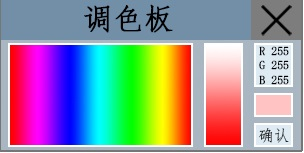

1.  色相-饱和度面板：横向为色相轴（0\~180），纵向为饱和度轴（0\~100）。鼠标点击色相-饱和度面板，会触发程序捕获相应的色相（H）、饱和度（S）数值，并将HSL变量（亮度L默认为0.5）转换为RGB变量。

2.  亮度面板：纵向为亮度轴（0\~100）。鼠标点击亮度面板，会触发程序捕获相应的亮度（L），并将HSL变量（H、S默认为0）转换为RGB变量。

3.  RGB色彩信息框：在每次色彩空间转换完成后，RGB变量将会格式化输出到色彩信息框内，以便用户更充分地了解色彩信息。

4.  呈色框：在每次色彩空间转换完成后，呈色框将呈现出所选颜色，以便用户更直接地获得所选颜色信息。

5.  确认：

>   点击“确认”按钮，保存所选颜色，关闭窗口。

1.  关闭：

>   点击“关闭”图标，不保存修改值，关闭窗口。

###### 放缩模式

1.  调用：

>   点击“设置”图标，弹出“模式”窗口。

>   默认情况下选择临近点插值法。

1.  确认：

>   点击“确认”按钮，保存选择的模式，并关闭窗口。

1.  关闭：

>   点击“取消”按钮，放弃选择的模式，并关闭窗口。

>   点击“关闭”图标，放弃选择的模式，并关闭窗口。

#### 界面设计

###### 欢迎界面

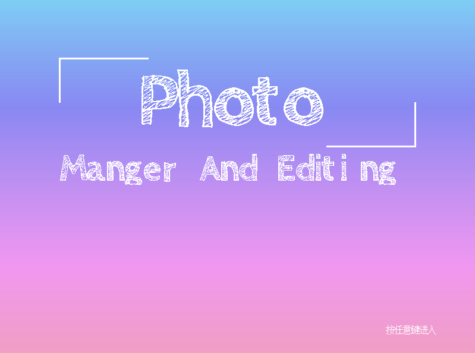

欢迎界面由标题和背景组成，标题使用汉字库制作，背景使用渐变函数制作（无贴图），界面内有动画显示。

###### 工作界面

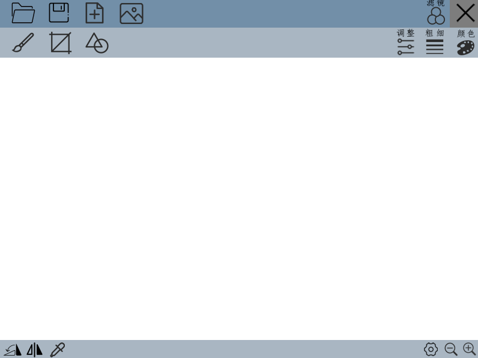

工作界面由各种工具以及中心工作区域组成。

用户在工作界面内可以打开图像，编辑图像，使用工具等等。

###### 图库窗口

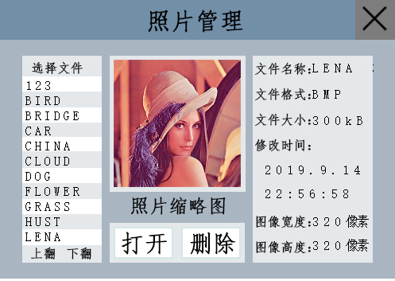

照片管理窗口由文件列表、信息框、缩略图、打开按钮、删除按钮组成。

###### 打开窗口

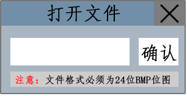

打开窗口由输入框、提示框、确认按钮组成。

###### 保存窗口

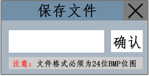

保存窗口由输入框、提示框、确认按钮组成。

###### 新建窗口

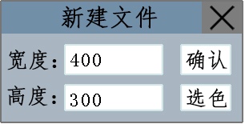

新建窗口由宽度输入框、高度输入框、确认按钮、选色按钮组成。

###### 粗细调整窗口

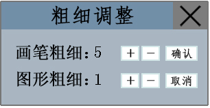

粗细调整窗口由画笔粗细调整按钮、图形粗细调整按钮、确认按钮、取消按钮组成。

###### 选色窗口

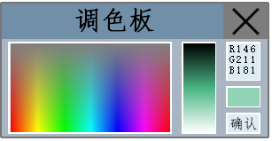

调色板窗口由色相-饱和度面板、亮度面板、RGB信息面板、呈色面板组成。

###### 放缩模式窗口

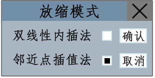

放缩模式窗口由模式选项部件、确认按钮、取消按钮组成。

###### 警告窗口

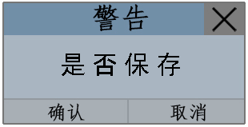

警告窗口由警告信息、确认按钮、取消按钮组成。

###### 滤镜窗口

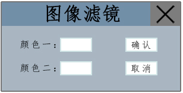

###### 调整窗口

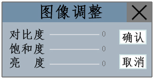

调整窗口由对比度、饱和度、亮度调整部件组成。

###### 效果展示

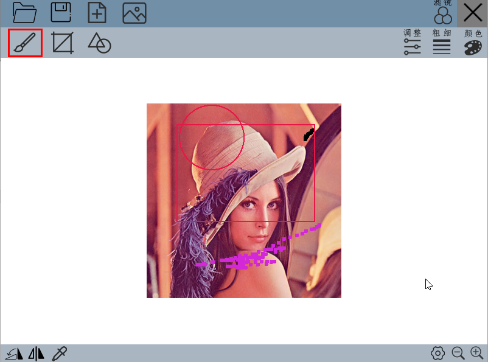

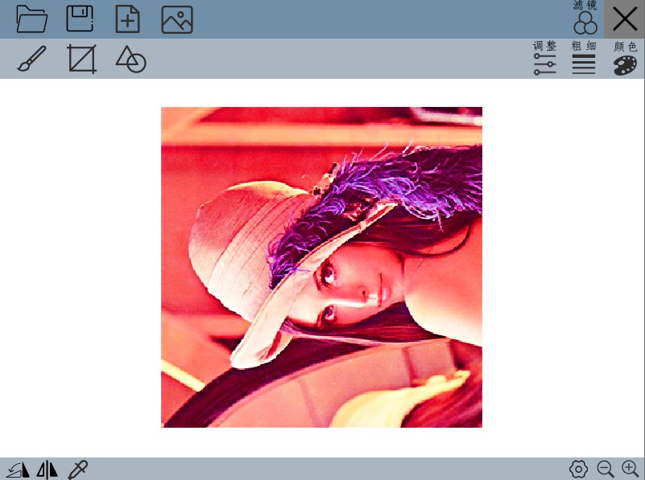

通过点击不同的功能图标，可实现不同的功能。

#### 软件结构

###### 5.3.1文件结构

**文件信息描述：**

BMP·········································图像储存区域

DATA·········································为数据处理区域

INCLUDE······································包含头文件

OUTPUT······································程序生成文件

SOURCR······································源文件代码

UI···········································图形界面

ZK···········································汉字库文件

###### 5.3.2库级关系

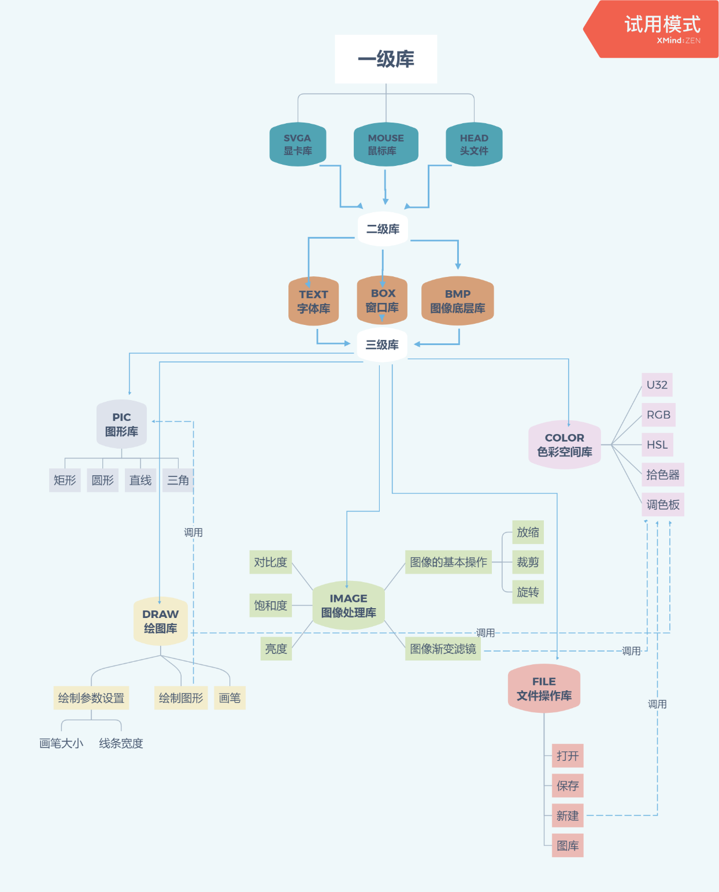

###### 5.3.3消息机制

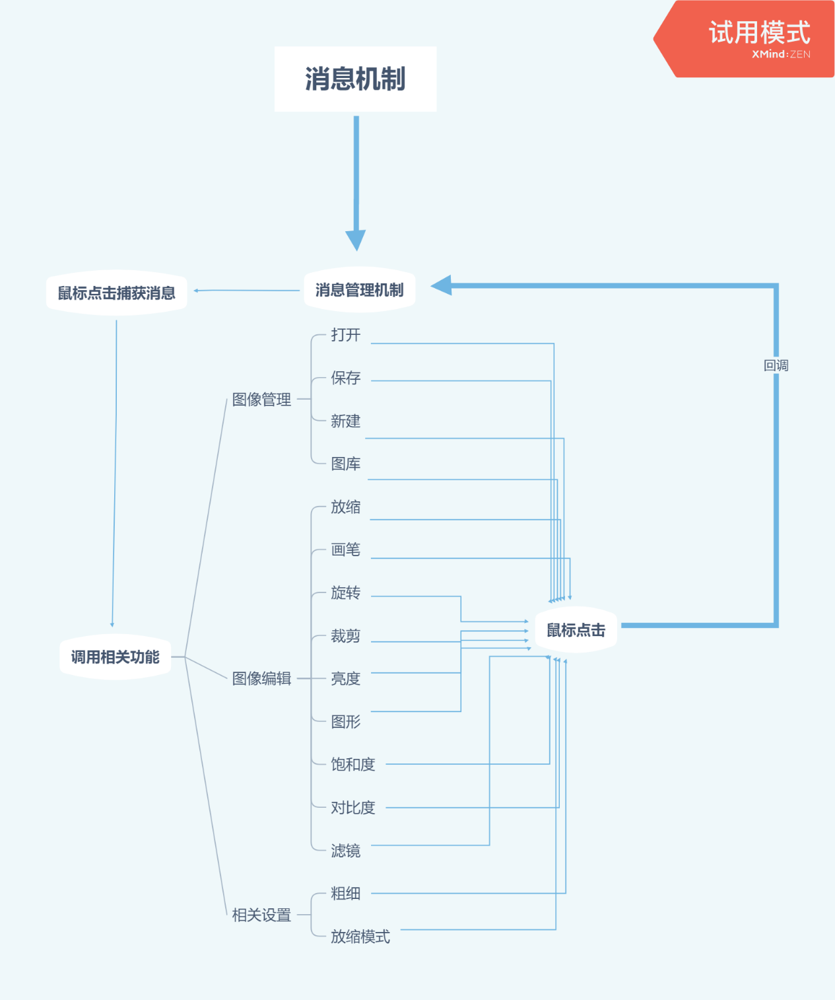

###### 5.3.4功能使用

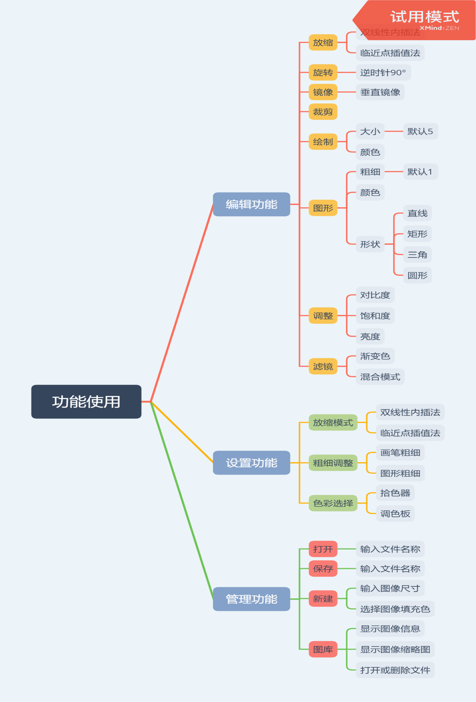

算法
----

#### 6.1色彩空间转换算法

>   图一： 左图： RGB模型 右图： HSL模型

-   从 RGB 到 HSL 的转换

1.  **int** RGB2HSL(RGB rgb, HSL\* hsl)  

2.  {  

3.      **double** rr, gg, bb;  

4.      **double** Max, Min;  

5.      **int**\* h = \&hsl-\>h;  

6.      **double**\* s = \&hsl-\>s;  

7.      **double**\* l = \&hsl-\>l;  

8.      rr = (**double**)rgb.r / 255.0;  

9.      gg = (**double**)rgb.g / 255.0;  

10.     bb = (**double**)rgb.b / 255.0;  

11.     Max = rr;  

12.     **if** (Max \< gg)  

13.     {  

14.         Max = gg;  

15.     }  

16.     **if** (Max \< bb)  

17.     {  

18.         Max = bb;  

19.     }  

20.     Min = rr;  

21.     **if** (Min \> gg)  

22.     {  

23.         Min = gg;  

24.     }  

25.     **if** (Min \> bb)  

26.     {  

27.         Min = bb;  

28.     }  

29.     //计算亮度  

30.     \*l = (Max + Min) / 2.0;  

31.     //计算色相  

32.     **if** (Max == Min)  

33.     {  

34.         \*h = 0;  

35.     }  

36.     **else** **if** (Max == rr && gg \>= bb)  

37.     {  

38.         \*h = 60 \* (gg - bb) / (Max - Min) + 0;  

39.     }  

40.     **else** **if** (Max == rr && gg \< bb)  

41.     {  

42.         \*h = 60 \* (gg - bb) / (Max - Min) + 360;  

43.     }  

44.     **else** **if** (Max == gg)  

45.     {  

46.         \*h = 60 \* (bb - rr) / (Max - Min) + 120;  

47.     }  

48.     **else** **if** (Max == bb)  

49.     {  

50.         \*h = 60 \* (rr - gg) / (Max - Min) + 240;  

51.     }  

52.     **else**  

53.     {  

54.         **return** 0;  

55.     }  

56.     //计算饱和度  

57.     **if** (\*l == 0 \|\| Max == Min)  

58.     {  

59.         \*s = 0;  

60.     }  

61.     **else** **if** (\*l \> 0 && \*l \<= 0.5)  

62.     {  

63.         \*s = (Max - Min) / (Max + Min);  

64.     }  

65.     **else** **if** (\*l \> 0.5)  

66.     {  

67.         \*s = (Max - Min) / (2 - (Max + Min));  

68.     }  

69.     **else**  

70.     {  

71.         **return** 0;  

72.     }  

73.     **return** 1;  

74. }  

-   从 HSL 到 RGB 的转换

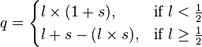

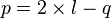

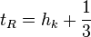

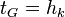

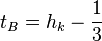

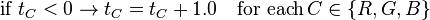

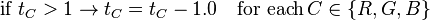

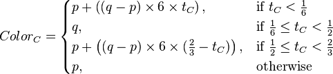

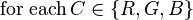

1.  **int** HSL2RGB(RGB\* rgb, HSL hsl)  

2.  {  

3.      **double** tR, tG, tB;  

4.      **double** p, q;  

5.      **double** hk;  

6.      u8\* r = \&rgb-\>r;  

7.      u8\* g = \&rgb-\>g;  

8.      u8\* b = \&rgb-\>b;  

9.  //如果S为0，则为灰度图

10.     **if** (hsl.s == 0)  

11.     {  

12.         tR = hsl.l;  

13.         tG = hsl.l;  

14.         tB = hsl.l;  

15.     }  

16.     **else**  

17.     {  

18.         **if** (hsl.l \< 0.5)  

19.         {  

20.             q = hsl.l \* (1.0 + hsl.s);  

21.         }  

22.         **else**  

23.         {  

24.             q = hsl.l + hsl.s - (hsl.l \* hsl.s);  

25.         }  

26.         p = 2.0 \* hsl.l - q;  

27.         hk = (**double**)hsl.h / 360.0;  

28.         tR = hk + 1.0 / 3.0;  

29.         tG = hk + 0;  

30.         tB = hk - 1.0 / 3.0;  

31.         tR = ToRGB(p, q, tR);  

32.         tG = ToRGB(p, q, tG);  

33.         tB = ToRGB(p, q, tB);  

34.     }  

35.     \*r = (**int**)(tR \* 255.0 + 0.5);  

36.     \*g = (**int**)(tG \* 255.0 + 0.5);  

37.     \*b = (**int**)(tB \* 255.0 + 0.5);  

38.     **return** 1;  

39. }  

40. **double** ToRGB(**double** p, **double** q, **double** tC)  

41. {  

42.     **double** ColorC;  

43.     **if** (tC \< 0)  

44.     {  

45.         tC = tC + 1.0;  

46.     }  

47.     **else** **if** (tC \> 1)  

48.     {  

49.         tC = tC - 1.0;  

50.     }  

51.     **else**  

52.     {  

53.         ;  

54.     }  

55.     **if** (tC \< (1.0 / 6.0))  

56.     {  

57.         ColorC = p + ((q - p) \* 6 \* tC);  

58.     }  

59.     **else** **if** (tC \>= (1.0 / 6.0) && tC \< 0.5)  

60.     {  

61.         ColorC = q;  

62.     }  

63.     **else** **if** (tC \>= 0.5 && tC \< (2.0 / 3.0))  

64.     {  

65.         ColorC = p + ((q - p) \* 6 \* (2.0 / 3.0 - tC));  

66.     }  

67.     **else**  

68.     {  

69.         ColorC = p;  

70.     }  

71.     **return** ColorC;  

72. }  

#### 6.2图像放缩算法

-   双线性内插法

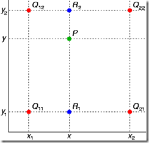

图二：双线性内插法

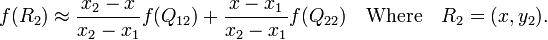

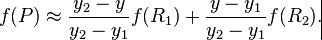

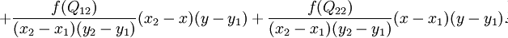

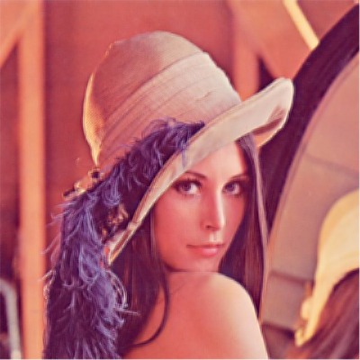

图三：双线性内插法效果

（双线性内插法代码见下）

-   临近点插值法

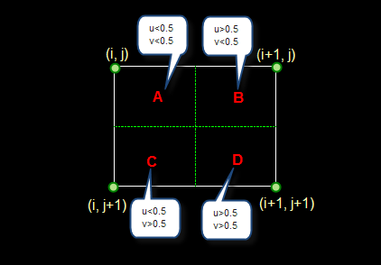

图四：临界点插值法

图五：临界点插值法效果图

1.  u32 ImageInterpolat(**int** x1, **int** x2, **int** y1, **int** y2, **double** x, **double** y, u8 patton)  

2.  {  

3.      **int** i;  

4.      u32 color[4];  

5.      RGB rgb[4];  

6.      **double** r1,r2,r,g1,g2,g,b1,b2,b;  

7.      color[0] = GetPixel(x1, y1);  

8.      color[1] = GetPixel(x2, y1);  

9.      color[2] = GetPixel(x1, y2);  

10.     color[3] = GetPixel(x2, y2);  

11.     **for** (i = 0; i \< 4; i++)  

12.     {  

13.         rgb[i].r = (u8)((color[i] & 0xff0000) \>\> 16);  

14.         rgb[i].g = (u8)((color[i] & 0x00ff00) \>\> 8);  

15.         rgb[i].b = (u8)((color[i] & 0x0000ff));  

16.     }  

17.     **if** (patton)  

18.     {  

19.         //双线性内插法  

20.         r1 = ((x2 - x) \* rgb[0].r + (x - x1) \* rgb[1].r) / (x2 - x1);  

21.         r2 = ((x2 - x) \* rgb[2].r + (x - x1) \* rgb[3].r) / (x2 - x1);  

22.         r = ((y2 - y) \* r1 + (y - y1) \* r2) / (y2 - y1);  

23.         g1 = ((x2 - x) \* rgb[0].g + (x - x1) \* rgb[1].g) / (x2 - x1);  

24.         g2 = ((x2 - x) \* rgb[2].g + (x - x1) \* rgb[3].g) / (x2 - x1);  

25.         g = ((y2 - y) \* g1 + (y - y1) \* g2) / (y2 - y1);  

26.         b1 = ((x2 - x) \* rgb[0].b + (x - x1) \* rgb[1].b) / (x2 - x1);  

27.         b2 = ((x2 - x) \* rgb[2].b + (x - x1) \* rgb[3].b) / (x2 - x1);  

28.         b = ((y2 - y) \* b1 + (y - y1) \* b2) / (y2 - y1);  

29.     }  

30.     **else**  

31.     {  

32.         //最邻近点插值法  

33.         **if** (x \>= x1 && x \<= x1 + 0.5 && y \>= y1 && y \<= y1 + 0.5)  

34.         {  

35.             r = rgb[0].r;  

36.             g = rgb[0].g;  

37.             b = rgb[0].b;  

38.         }  

39.         **else** **if** (x \> x1 + 0.5 && x \<= x2 && y \>= y1 && y \<= y1 + 0.5)  

40.         {  

41.             r = rgb[1].r;  

42.             g = rgb[1].g;  

43.             b = rgb[1].b;  

44.         }  

45.         **else** **if** (x \>= x1 && x \<= x1 + 0.5 && y \> y1 + 0.5 && y \<= y2)  

46.         {  

47.             r = rgb[2].r;  

48.             g = rgb[2].g;  

49.             b = rgb[2].b;  

50.         }  

51.         **else** **if** (x \> x1 + 0.5 && x \<= x2 && y \> y1 + 0.5 && y \<= y2)  

52.         {  

53.             r = rgb[3].r;  

54.             g = rgb[3].g;  

55.             b = rgb[3].b;  

56.         }  

57.         **else**  

58.         {  

59.             **return** 0;  

60.         }  

61.     }  

62.     **return** RGB2U32(r, g, b); 

63. }  

#### 6.3图像调节算法

-   对比度调节算法

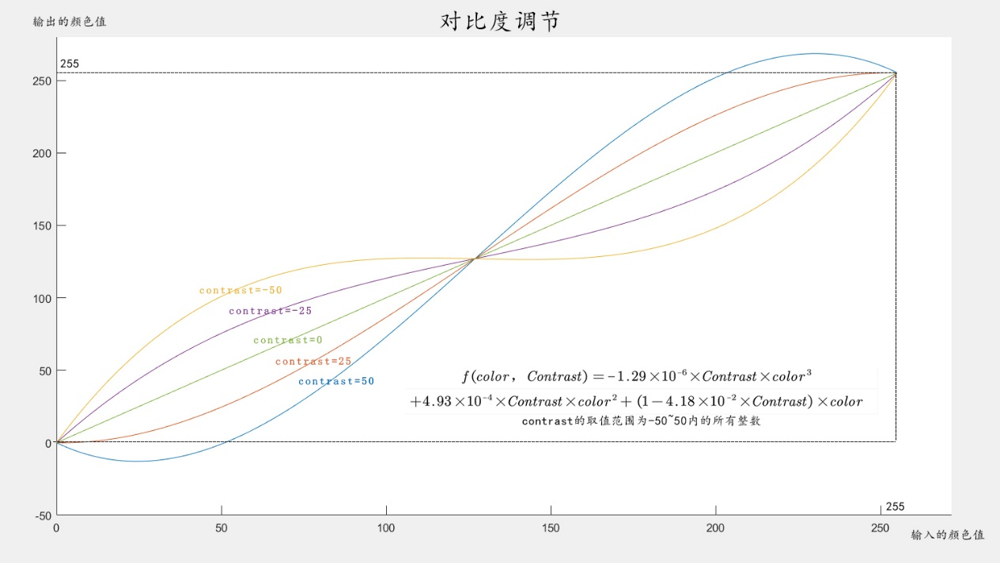

图六：对比度函数的图像

对比度实现的原理：

对比度调节函数通过模拟“S”型曲线，改变图像的色彩值：如果contrast \<
0，则图像中小与阈值（127）的像素的值将增加，大于阈值的像素的值将减小；如果contrast
\>
0，则图像中小于阈值（127）的像素的值将减小，大于阈值的像素的值将增加；如果contrast
= 0，则图像不变。

对比度调节的过程分为两步：第一步，判断当前图像的对比度是否为零，如果不为零，通过逆向变换得到对比度为零时的原图；如果为零，则直接进入第二步。第二步，通过正向变化得到调整后的图像。

对比度调节公式见下：

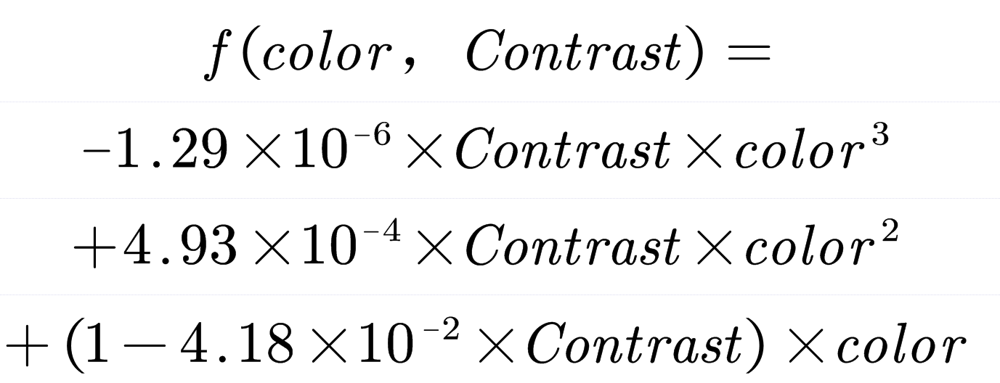

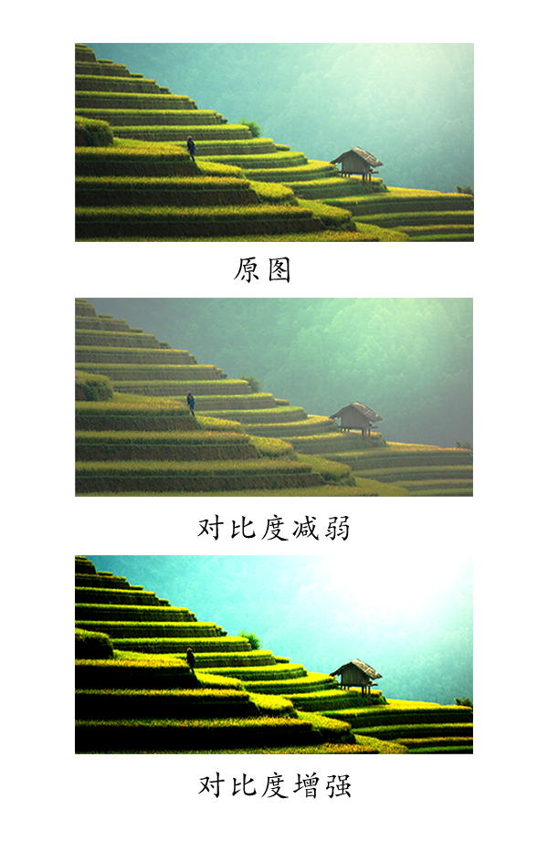

图七：对比度调节效果图

1.  **int** ImageContrast(BMPATTR attr,**int** value)  

2.  {  

3.      **int** i, j;       //循环变量  

4.      u32 oldcolor;   //色彩变量  

5.      RGB rgb;        //色彩分量  

6.      **if** (value \>= -50 && value \<= 50)  

7.      {  

8.          **for** (i = attr.y1; i \< attr.y2; i++)  

9.          {  

10.             **for** (j = attr.x1; j \< attr.x2; j++)  

11.             {  

12.                 oldcolor = GetPixel(j, i);  

13.                 U32TRGB(&rgb, oldcolor);  

14.                 //计算公式  

15.                 rgb.r = ContrastCalc(rgb.r, value);  

16.                 rgb.g = ContrastCalc(rgb.g, value);  

17.                 rgb.b = ContrastCalc(rgb.b, value);  

18.                 //类型转换  

19.                 oldcolor = RGB2U32(rgb.r, rgb.g, rgb.b);  

20.                 PutPixel(j, i, oldcolor);  

21.             }  

22.         }  

23.     }  

24.     **else**  

25.     {  

26.         //范围超出  

27.         **return** -1;  

28.     }  

29.     **return** 0;  

30. }  

31. u8 ContrastCalc(u8 color,**int** param)  

32. {  

33.     **int** tcolor;  

34.     **if** (param \> 50 \|\| param \< -50)  

35.     {  

36.         //如果输入调节参数超出限制范围  

37.         **return** -1;  

38.     }  

39.     tcolor = -1.29 \* param \* pow(color, 3) \* 1e-6 + 4.93 \* param \* pow(color, 2) \* 1e-4 + (1 - 4.18 \* param \* 1e-2) \* color;  

40.     //函数原型为：f(x)=a\*x\^3+bx\^2+cx，通过此函数模拟“S”型灰度曲线。  

41.     **if** (tcolor \> 255)  

42.     {  

43.         **return** 255;  

44.     }  

45.     **else** **if** (tcolor \< 0)  

46.     {  

47.         **return** 0;  

48.     }  

49.     **else**  

50.     {  

51.         **return** tcolor;  

52.     }  

53. }  

-   饱和度调节算法

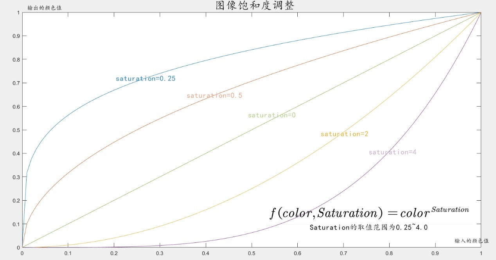

图八：饱和度调节函数曲线

饱和度实现的原理：

饱和度调节函数通过模拟指数型曲线，改变图像的色彩值：如果saturation \<
1，则图像中所有像素的饱和度将增加；如果saturation \>
1，则图像中所有像素的饱和度将减小；如果saturation = 1，则图像不变。

饱和度调节的过程：第一步，判断当前图像的饱和度是否为1，如果不为1，则计算饱和度变化的倍率（本次的饱和度=选定的饱和度/上次的饱和度）；如果为1，则直接进入第二步。第二步，将计算后的倍率作为参数调节图像的饱和度。

饱和度调节公式见下：

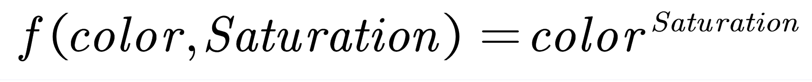

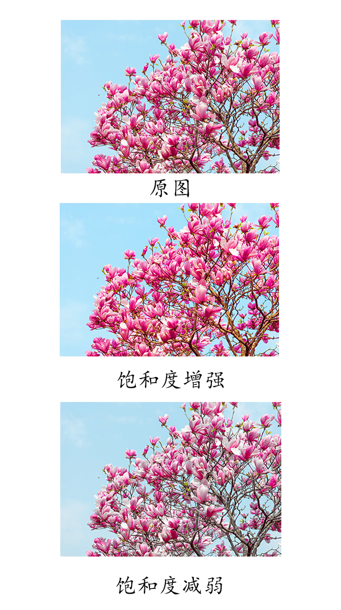

图九：饱和度调节效果图

-   亮度调节算法

>   亮度调节与饱和度调节相似，公式为：

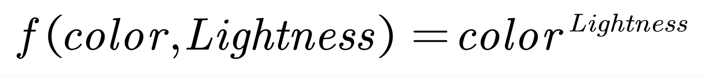

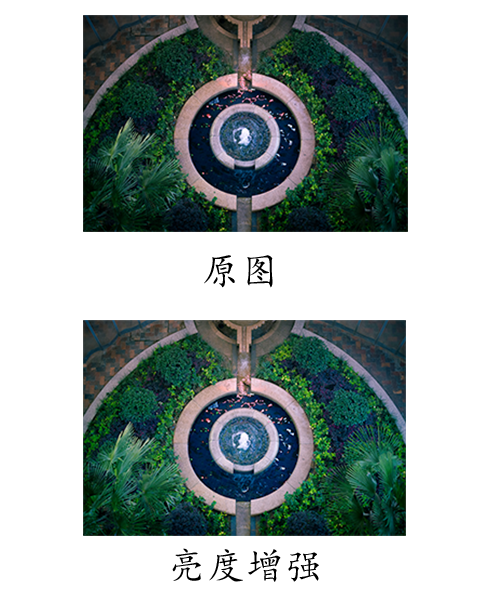

图十：亮度调节效果图

1.  **int** ImageLightness(BMPATTR attr, **double** times)  

2.  {  

3.      **int** i, j;       //循环变量  

4.      u32 oldcolor;   //色彩变量  

5.      RGB rgb;        //色彩分量  

6.      HSL hsl;        //色彩分量  

7.      **if** (times \<= 4 && times \>= 0.25)  

8.      {     

9.          **for** (i = attr.y1; i \< attr.y2; i++)  

10.         {  

11.             **for** (j = attr.x1; j \< attr.x2; j++)  

12.             {  

13.                 oldcolor = GetPixel(j, i);  

14.                 //类型转换  

15.                 U32TRGB(&rgb, oldcolor);  

16.                 RGB2HSL(rgb, \&hsl);  

17.                 //计算公式  

18.                 hsl.l = pow(hsl.l, 1 / times);  

19.                 //类型转换  

20.                 HSL2RGB(&rgb, hsl);  

21.                 oldcolor = RGB2U32(rgb.r, rgb.g, rgb.b);  

22.                 PutPixel(j, i, oldcolor);  

23.             }  

24.         }  

25.     }  

26.     **else**  

27.     {  

28.         //范围超出  

29.         **return** -1;  

30.     }  

31.     **return** 0;  

32. }  

#### 6.4渐变滤镜算法

-   渐变算法

>   首先将颜色值转换为RGB，再转换为HSL，根据起始颜色和终止颜色的HSL值以及渐变图形的高度，计算出每一行的色相、饱和度、亮度各变化量：

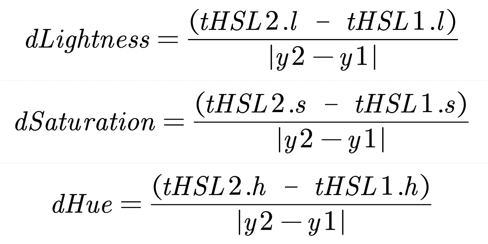

>   由于亮度和饱和度均为double型，故每一行直接增加一个微小的增量（dLightness、dSaturation）即可。而对于int型的变量色相，直接加dHue相对于加0，其色相并不会改变，故需要从起始值开始累计增量，且需要四舍五入保留整数部分：

>   代码如下：

1.  **void** ImgShading(**int** x1, **int** y1, **int** x2, **int** y2, u32 color1, u32 color2)  

2.  {  

3.      **int** i = 0, j = 0;           //循环变量  

4.      **int** temp1, temp2;           //用于交换的临时变量  

5.      HSL tHSL1, tHSL2;           //存储HSL的临时变量  

6.      RGB tRGB1, tRGB2;           //存储RGB的临时变量  

7.      **int** tHue0;                  //用于计算色相的临时变量  

8.      **double** dLightness;          //每行渐变的亮度的值  

9.      **double** dSaturation;         //每行渐变的饱和度的值  

10.     **double** dHue;                //每行渐变的色相的值  

11.     U32TRGB(&tRGB1, color1);    //获取color的RGB值  

12.     U32TRGB(&tRGB2, color2);  

13.     RGB2HSL(tRGB1, \&tHSL1);     //将RGB转化为HSL  

14.     RGB2HSL(tRGB2, \&tHSL2);  

15.     tHue0 = tHSL1.h;                                      //赋初值  

16.     dLightness = (tHSL2.l - tHSL1.l) / fabs(y1 - y2);     //计算每行渐变的亮度的值  

17.     dSaturation = (tHSL2.s - tHSL1.s) / fabs(y1 - y2);    //计算每行渐变的饱和度的值  

18.     dHue = (tHSL2.h - tHSL1.h) / fabs(y1 - y2);           //计算每行渐变的色相的值  

19.     delay(100);  

20.     /\*确保x1 \< x2\*/  

21.     **if** (x1 \> x2)  

22.     {  

23.         temp1 = x1;  

24.         x1 = x2;  

25.         x2 = temp1;  

26.     }  

27.     /\*确保y1 \< y2\*/  

28.     **if** (y1 \> y2)  

29.     {  

30.         temp2 = y1;  

31.         y1 = y2;  

32.         y2 = temp2;  

33.     }  

34.     //渐变背景  

35.     **for** (i = y1; i \< y2; i++)  

36.     {  

37.         **for** (j = x1; j \< x2; j++)  

38.         {  

39.             PutPixel(j, i, color1);  

40.         }  

41.         /\*计算渐变一行后的HSL值\*/  

42.         tHSL1.l = tHSL1.l + dLightness;  

43.         tHSL1.s = tHSL1.s + dSaturation;  

44.         tHSL1.h = (**int**)(tHue0 + dHue \* i + 0.5);  

45.         HSL2RGB(&tRGB1, tHSL1);                         //将HSL转化为RGB  

46.         color1 = RGB2U32(tRGB1.r, tRGB1.g, tRGB1.b);    //将RGB转化为颜色值赋给color  

47.     }  

48. }  

-   混合算法

叠加模式通过分析基色每个通道的数值，对颜色进行正片叠加或滤色混合，结果色保留基色的明暗对比，因此结果色以基色为主导。计算公式：

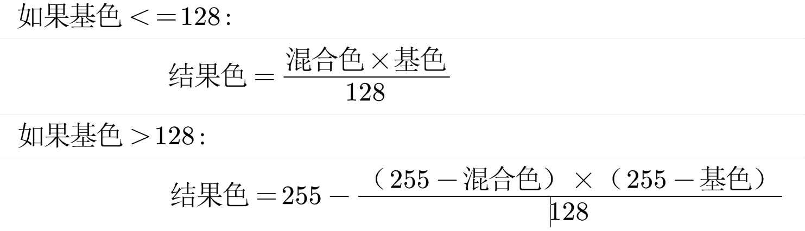

从公式可以看出，结果色会根据基色的颜色数值选择不同的计算公式。

叠加在保留底色明暗变化的基础上还能使绘图的颜色被叠加到底色上，但保留底色的高光和阴影部分。底色的颜色没有被取代，而是和绘图色混合来体现原图的亮部和暗部。使用此模式可使底色的图像的饱和度及对比度得到相应的提高，使图像看起来更加鲜亮。

但单纯叠加会导致图像的饱和度和对比度过高，因此还需要在叠加之后再按照原图与新图7：3的比例将二者混合：

const double percent = 0.7; //混合时背景图案所占的比例

tRGB.r = (unsigned char)(percent \* tRGB1.r + (1 - percent) \* tRGB.r);

tRGB.g = (unsigned char)(percent \* tRGB1.g + (1 - percent) \* tRGB.g);

tRGB.b = (unsigned char)(percent \* tRGB1.b + (1 - percent) \* tRGB.b);

代码如下：

1.  **void** ImgMix(**int** x1, **int** y1, **int** x2, **int** y2, u32 color1, u32 color2)  

2.  {  

3.      **int** i, j;                      //循环变量  

4.      **int** temp1, temp2;              //用于交换的临时变量  

5.      **const** **double** percent = 0.7;    //混合时背景图案所占的比例  

6.      u32 color_scr1;                //用于获取背景图案的颜色值  

7.      u32 color_scr2;                //用于获取渐变矩形的颜色值  

8.      u32 color_dst;                 //用于计算所得结果的颜色值  

9.      RGB tRGB;                      //将计算结果的颜色值转化为RGB  

10.     RGB tRGB1;                     //将背景图案的颜色值转化为RGB  

11.     RGB tRGB2;                     //将渐变矩形的颜色值转化为RGB  

12.     **FILE**\* fp;                      //将背景图案每一点的颜色值读取出来存入文件中，再从文件中读取颜色值用于计算  

13.     /\*以二进制只写模式打开临时文件，如果文件打开失败，退出\*/  

14.     **if** ((fp = fopen("DATA//temp2", "wb")) == NULL)  

15.     {  

16.         exit(0);  

17.     }  

18.     /\*确保x1 \< x2\*/  

19.     **if** (x1 \> x2)  

20.     {  

21.         temp1 = x1;  

22.         x1 = x2;  

23.         x2 = temp1;  

24.     }  

25.     /\*确保y1 \< y2\*/  

26.     **if** (y1 \> y2)  

27.     {  

28.         temp2 = y1;  

29.         y1 = y2;  

30.         y2 = temp2;  

31.     }  

32.     /\*读取每一点的颜色值，并写入文件\*/  

33.     **for** (j = y1; j \< y2; j++)  

34.     {  

35.         **for** (i = x1; i \< x2; i++)  

36.         {  

37.             color_scr1 = GetPixel(i, j);  

38.             fwrite(&color_scr1, 4, 1, fp);  

39.         }  

40.     }  

41.     fclose(fp);    //关闭文件  

42.     ImgShading(x1, y1, x2, y2, color1, color2);    //画渐变矩形  

43.     /\*以二进制只读模式打开临时文件，如果文件打开失败，退出\*/  

44.     **if** ((fp = fopen("DATA//temp2", "rb")) == NULL)  

45.     {  

46.         exit(0);  

47.     }  

48.     /\*将背景图案的颜色值读出后，与渐变矩形的RGB按一定比例混合\*/  

49.     **for** (j = y1; j \< y2; j++)  

50.     {  

51.         **for** (i = x1; i \< x2; i++)  

52.         {  

53.             /\*分别获取背景图案和渐变矩形的颜色值，并将其转化为RGB\*/  

54.             fread(&color_scr1, 4, 1, fp);  

55.             color_scr2 = GetPixel(i, j);  

56.             U32TRGB(&tRGB1, color_scr1);  

57.             U32TRGB(&tRGB2, color_scr2);  

58.             /\*计算混合后的RGB\*/  

59.             **if** (tRGB1.r \<= 128)  

60.             {  

61.                 tRGB.r = (unsigned **char**)(tRGB1.r \* tRGB2.r / 128);  

62.             }  

63.             **else**  

64.             {  

65.                 tRGB.r = (unsigned **char**)(255 - (255 - tRGB1.r) \* (255 - tRGB2.r) / 128);  

66.             }  

67.             **if** (tRGB1.g \<= 128)  

68.             {  

69.                 tRGB.g = (unsigned **char**)(tRGB1.g \* tRGB2.g / 128);  

70.             }  

71.             **else**  

72.             {  

73.                 tRGB.g = (unsigned **char**)(255 - (255 - tRGB1.g) \* (255 - tRGB2.g) / 128);  

74.             }  

75.             **if** (tRGB1.b \<= 128)  

76.             {  

77.                 tRGB.b = (unsigned **char**)(tRGB1.b \* tRGB2.b / 128);  

78.             }  

79.             **else**  

80.             {  

81.                 tRGB.b = (unsigned **char**)(255 - (255 - tRGB1.b) \* (255 - tRGB2.b) / 128);  

82.             }  

83.             tRGB.r = (unsigned **char**)(percent \* tRGB1.r + (1 - percent) \* tRGB.r);  

84.             tRGB.g = (unsigned **char**)(percent \* tRGB1.g + (1 - percent) \* tRGB.g);  

85.             tRGB.b = (unsigned **char**)(percent \* tRGB1.b + (1 - percent) \* tRGB.b);  

86.             /\*将混合后的RGB转化为颜色值，并画点\*/  

87.             color_dst = RGB2U32(tRGB.r, tRGB.g, tRGB.b);  

88.             PutPixel(i, j, color_dst);  

89.         }  

90.     }  

91.     fclose(fp);    //关闭文件  

92. }  

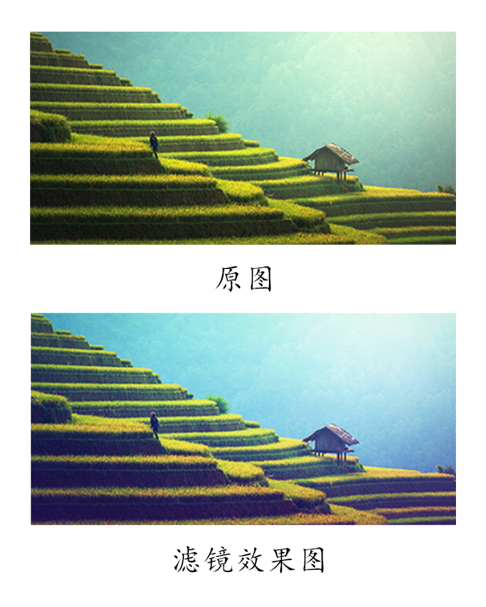

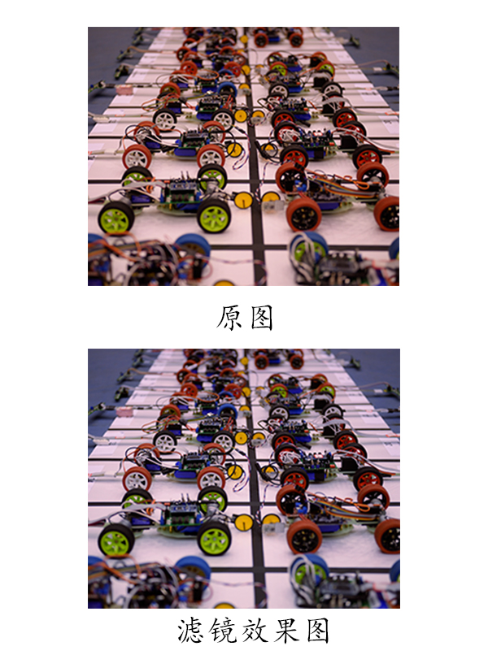

####  6.5 Bresenham算法

-   画直线算法

>   由于显示直线的象素点只能取整数值坐标，可以假设直线上第i个象素点坐标为(*x*i，*y*i)，它是直线上点(xi，yi)的最佳近似，并且*x*i=xi(假设m\<1），如下图所示。那么，直线上下一个象素点的可能位置是(*x*i+1，*y*i)或(*x*i+1，*y*i+1)。

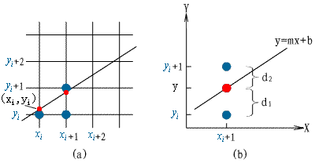

>    

>   　　由图中可以知道，在x=*x*i+1处，直线上点的y值是y=m(*x*i+1)+b，该点离象素点(*x*i+1，*y*i)和象素点(*x*i+1，*y*i+1)的距离分别是d1和d2：   
>    

| d1=y-*y*i=m(*x*i+1)+b-*y*i         | (2－8) |
|------------------------------------|--------|
| d2=(*y*i+1)-y=(*y*i+1)-m(*x*i+1)-b | (2－9) |

>   　　这两个距离差是

| d1-d2=2m(*x*i+1)-2*y*i＋2b-1 | (2－10) |
|------------------------------|---------|

>   　　我们来分析公式(2-10)：  
>   　　(1)当此值为正时，d1\>d2，说明直线上理论点离(*x*i+1，*y*i+1)象素较近，下一个象素点应取(*x*i+1，*y*i+1)。  
>   　　(2)当此值为负时，d1\<d2，说明直线上理论点离(*x*i+1，*y*i)象素较近，则下一个象素点应取(*x*i+1，*y*i)。  
>   　　(3)当此值为零时，说明直线上理论点离上、下两个象素点的距离相等，取哪个点都行，假设算法规定这种情况下取(*x*i+1，*y*i+1)作为下一个象素点。

>   　　因此只要利用(d1-d2)的符号就可以决定下一个象素点的选择。为此，我们进一步定义一个新的判别式：

| pi=△x×(d1-d2)=2△y·*x*i-2△x·*y*i+c | (2－11) |
|-----------------------------------|---------|

>   　　式(2-11)中的△x=(x2-x1)\>0，因此pi与(d1-d2)有相同的符号；

>   　　这里△y=y2-y1，m=△y/△x；c=2△y+△x(2b-1)。

>   　　下面对式(2-11)作进一步处理，以便得出误差判别递推公式并消除常数c。

>   　　将式(2-11)中的下标i改写成i+1，得到：

| pi+1=2△y·*x*i+1-2△x·*y*i+1+c | (2－12) |
|------------------------------|---------|

>    

>   　　将式(2-12)减去(2-11)，并利用*x*i+1=*x*i+1，可得：

| pi+1= pi+2△y-2△x·(*y*i+1-*y*i) | (2－13) |
|--------------------------------|---------|

>   　　再假设直线的初始端点恰好是其象素点的坐标，即满足：

| *y*1=m*x*1+b | (2－14) |
|--------------|---------|

>   　　由式(2-11)和式(2-14)得到p1的初始值：

| p1=2△y-△x | (2－15) |
|-----------|---------|

>   　　这样，我们可利用误差判别变量，得到如下算法表示：

|   | 初始 　　　 p1=2△y-△x                                                    | (2－16) |
|---|--------------------------------------------------------------------------|---------|
|   | 当pi≥0时： yi+1=yi+1,                                                    |         |
|   | 　　　　　　xi+1=xi+1，                                                  |         |
|   | 　　　　　　pi+1=pi+2(△y-△x)                                             |         |
|   | 否则：　　　yi+1=yi,                                                     |         |
|   | 　　　　　　xi+1=xi+1，                                                  |         |
|   | 　　　　　　pi+1=pi+2△y                                                  |         |

>    

>   　　从式(2-16)可以看出，第i+1步的判别变量pi+1仅与第i步的判别变量pi、直线的两个端点坐标分量差△x和△y有关，运算中只含有整数相加和乘2运算，而乘2可利用算术左移一位来完成，因此这个算法速度快并易于硬件实现。

代码如下：

1.  **int** Line(**int** x1, **int** y1, **int** x2, **int** y2, u32 color, u8 size)  

2.  {  

3.      **int** x, y;  

4.      **int** dx, dy;  

5.      **int** s1, s2;  

6.      **int** error;  

7.      **int** temp;  

8.      **int** interchange;  

9.      **int** i;  

10.     x = x1;  

11.     y = y1;  

12.     dx = abs(x2 - x1);  

13.     dy = abs(y2 - y1);  

14.     **if** (x2 \> x1)  

15.     {  

16.         s1 = 1;  

17.     }  

18.     **else**  

19.     {  

20.         s1 = -1;  

21.     }  

22.     **if** (y2 \> y1)  

23.     {  

24.         s2 = 1;  

25.     }  

26.     **else**  

27.     {  

28.         s2 = -1;  

29.     }  

30.     **if** (dy \> dx)  

31.     {  

32.         temp = dx;  

33.         dx = dy;  

34.         dy = temp;  

35.         interchange = 1;  

36.     }  

37.     **else**  

38.     {  

39.         interchange = 0;  

40.     }  

41.     error = 2 \* dy - dx;  

42.     **for** (i = 1; i \<= dx; i++)  

43.     {  

44.         DrawPixel(x, y, color, size);    //画点  

45.         **if** (error \>= 0)  

46.         {  

47.             **if** (interchange == 0)  

48.             {  

49.                 y = y + s2;  

50.             }  

51.             **else**  

52.             {  

53.                 x = x + s1;  

54.             }  

55.             error = error - 2 \* dx;  

56.         }  

57.         **if** (interchange == 0)  

58.         {  

59.             x = x + s1;  

60.         }  

61.         **else**  

62.         {  

63.             y = y + s2;  

64.         }  

65.         error = error + 2 \* dy;  

66.     }  

67.     **return** 1;  

68. }  

-   画圆算法

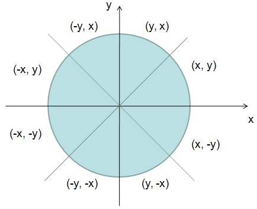

显然，我们只需要知道了圆上的一个点的坐标 (x, y)
，利用八对称性，我们马上就能得到另外七个对称点的坐标。

和直线算法类似，Bresenham画圆算法也是用一系列离散的点来近似描述一个圆，如下图。

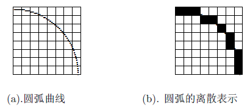

Bresenham画圆算法的流程图如下：

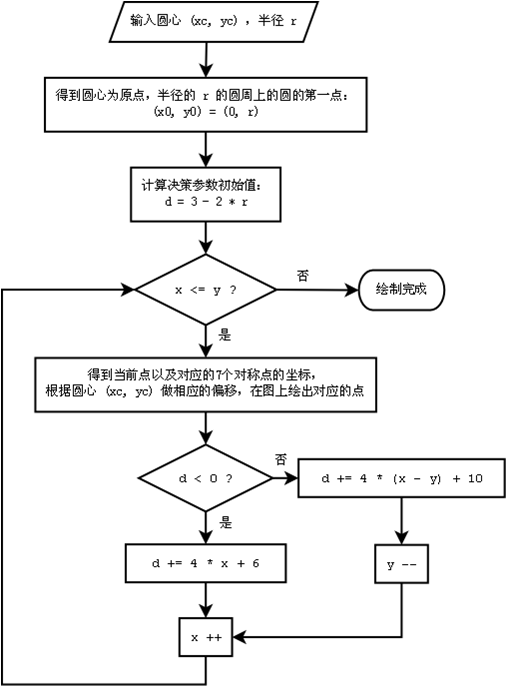

可以看到，与画线算法相比，画圆的循环中用到了整数的乘法，相对复杂了一些。

代码如下：

1.  **int** Circle(**int** x, **int** y, **int** r, u32 color, u8 size)  

2.  {  

3.      **int** a = 0;  

4.      **int** b = r;  

5.      **int** error = 3 - 2 \* r;  

6.      **while** (a \<= b)  

7.      {  

8.          DrawCircle_8(x, y, a, b, color, size);  

9.          **if** (error \< 0)  

10.         {  

11.             error = error + 4 \* a + 6;  

12.         }  

13.         **else**  

14.         {  

15.             error = error + 4 \* (a - b) + 10;  

16.             b--;  

17.         }  

18.         a++;  

19.     }  

20.     **return** 1;  

21. }  

22. **void** DrawCircle_8(**int** x, **int** y, **int** a, **int** b, u32 color, u8 size)  

23. {  

24.     DrawPixel(x + a, y + b, color, size);  

25.     DrawPixel(x - a, y + b, color, size);  

26.     DrawPixel(x + a, y - b, color, size);  

27.     DrawPixel(x - a, y - b, color, size);  

28.     DrawPixel(x + b, y + a, color, size);  

29.     DrawPixel(x - b, y + a, color, size);  

30.     DrawPixel(x + b, y - a, color, size);  

31.     DrawPixel(x - b, y - a, color, size);  

32. }  

组员分工及时间安排
------------------

#### 7.1 组员分工

| 姓名   | 分工                             | 备注 |
|--------|----------------------------------|------|
| 王子毅 | **底层编写：**                   |      |
| 牛宝健 | **底层编写** 图形库 **功能设计** |      |

1.  SVGA模式

2.  点阵字库

3.  BMP打开与保存

4.  色彩空间模型

**功能设计：**

1.  图片打开

2.  图片新建

3.  图片保存

4.  图库管理

5.  放缩功能

6.  放缩模式设置

7.  粗细设置

8.  调色板

9.  饱和度调整

10. 对比度调整

11. 亮度调整

12. 画笔

13. 图形

（直线、圆形、三角、

矩形）

1.  拾色器

2.  图像裁剪

3.  图像旋转

4.  图形镜像

5.  图像裁剪

6.  渐变滤镜

7.  登入界面

#### 7.2 时间安排

| 时间     | 任务                                                       | 备注 |
|----------|------------------------------------------------------------|------|
| 第一周   | 查找相关资料，设计程序结构。                               |      |
| 第二周   | 查找相关资料，修改SVGA模块。                               |      |
| 第三周   | 初步设计图形界面。                                         |      |
| 第四周   | 编写BMP文件读写底层函数，实现图像的打开及保存。            |      |
| 第五周   | 设计照片管理模块：照片的打开、保存、新建、删除等。         |      |
| 第六周   | 实现图像放缩、旋转、镜像、裁剪等基本功能。                 |      |
| 第七周   | 设计图像画笔功能，编写图形库。                             |      |
| 第八周   | 查找相关资料，建立色彩空间模型，实现RGB、HSL色彩空间转换。 |      |
| 第九周   | 编写工具模块：拾色器、调色板、粗细调整。                   |      |
| 第十周   | 编写图像处理功能：调整对比度、饱和度、亮度。               |      |
| 第十一周 | 实现图像渐变混合滤镜特效。                                 |      |
| 第十二周 | 修改代码，优化算法。                                       |      |

#### 7.2 代码行数

代码量总计：6230+336=6566行，其中组员王子毅的代码量为3306行，牛宝健的代码量为3306行。

| 文件名   | 代码量 | 牛保健 | 王子毅 |
|----------|--------|--------|--------|
| bmp.c    | 311    | 0      | 311    |
| box.c    | 389    | 289    | 100    |
| color.c  | 653    | 240    | 413    |
| draw.c   | 1833   | 1715   | 118    |
| file.c   | 706    | 0      | 706    |
| image.c  | 1427   | 423    | 1004   |
| main.c   | 17     | 0      | 17     |
| menu.c   | 255    | 0      | 255    |
| pic.c    | 639    | 639    | 0      |
| text.c   | 382    | 0      | 382    |
| 总代码量 | 6230   | 3306   | 3306   |
|          |        |        |        |
| bmp.h    | 36     |        |        |
| box.c    | 32     |        |        |
| color.c  | 28     |        |        |
| draw.c   | 28     |        |        |
| file.h   | 30     |        |        |
| head.h   | 100    |        |        |
| image.h  | 38     |        |        |
| menu.h   | 20     |        |        |
| pic.h    | 24     |        |        |
| text.h   | 18     |        |        |
| 总代码量 | 336    |        |        |
|          |        |        |        |
| svga.c   | 135    |        |        |
| svga.h   | 15     |        |        |

总结
----

#### 8.1组员王子毅总结

暑假期间，我就开始了C语言程序设计。

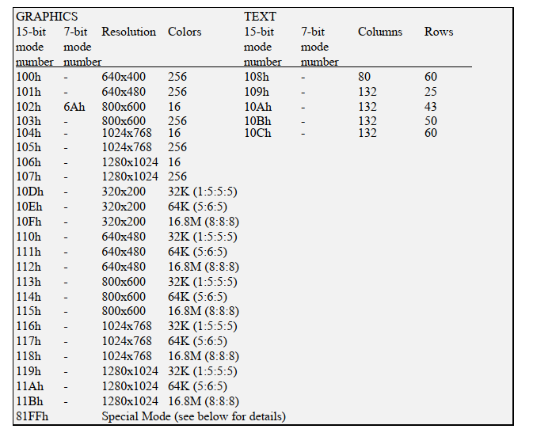

因为我做的是照片管理与编辑系统，因此第一步要确定的是如何将一张图显示出来。通过查阅资料，我知道要不一张图显示出来，要使用SVGA模式。但是往届的代码SVGA模式都是16位的（5：6：5），而一般的BMP位图都是24位的（8：8：8），这样就出现了两种问题：1.图像颜色数据损失2.图像处理不方便，需要数值转换。因此我就开始寻找更好的SVGA模式。通过google搜索了一上午，我终于找到了一个文件VESA
BIOS Extensions。

在这个文件中我发现SVGA其实是有全彩模式的，例如图中的115h和118h等。一开始我尝试了118h模式，但是屏幕中的一部分区域无法控制。后来尝试115h模式发现没有这个问题。于是我分析问题发现：BC31的显存为32\*64kb=2Mb，但是118h模式下所需要的显存为：1024\*768\*4/1024/1024=3Mb,因此最后面的1Mb的像素无法控制，而115h模式下所需要的显存为：1.83Mb左右，因此可以实现。

完成了SVGA底层，然后就要实现BMP的读写。之后，我查找资料，学习BMP文件内部结构，最终成功地将BMP显示出来。

后来要写调色板，我决定要写一个可以选择所有颜色（2563种）的拾色器。查阅资料，如果要做这种调色板首先要实现HSL色彩空间与RGB色彩空间颜色转换的功能。于是，我进一步编写了色彩空间库（color.h），最终实现了这些功能。

后来我又在色彩空间库的基础上，写了饱和度、对比度、亮度算法，并协助队友做了渐变函数，滤镜功能等等。

C课设让我学习到了很多：从底层BISO的操作、SVGA的模式、点阵字库等等，到高级的算法：色彩空间转换、双线性插值法、图像混合模式等等。我从C课设中也学会了团队合作，如何通过GIT高效的管理代码、合并版本等等。还有程序设计的思想：各个模块的接口如何去做，才能实现对接。

正如爱尔兰曾经提到过，越是无能的人，越喜欢挑剔别人的错儿。所以我们不能抱怨C课设难度过大。池田大作说过一句著名的话，不要回避苦恼和困难，挺起身来向它挑战，进而克服它。虽然C课设难度比较大，但是我们就应该迎难而上。罗曼·罗兰说过一句著名的话，只有把抱怨环境的心情，化为上进的力量，才是成功的保证。带着这句话，我们不断在C课设的道路上前行。

#### 8.2组员牛宝健总结

本次课程设计是我第一次完整写一个应用软件程序，尽管只有短短的几个月时间，但我已经从上学期只会敲几十行代码的简单程序，到现在能够敲几千行代码，做出一个可以成功运行的小软件。感觉自己真的收获满满。

刚开始的时候，整个人对课程设计还没有概念，完全不知道自己应该从何入手，但随着与队友的沟通，自己在网上搜集资料、查找算法，自己也慢慢开始对整个课设有了一个总体的概念。但是从0到1的突破往往是不容易的，开学第一周的时候，我基本上都在和队友讨论该如何去实现我们的应用，分析应该将整个课设分为几个部分，明确各自的分工。在做好这些准备工作之后，我也就开始真刀真枪地去开始一行行地写代码了。真的，当我第一次写完自己的第一个函数，并且可以在BC上运行的时候，那种成就感真的是无以言表。

在实现了第一个函数功能之后，剩下函数的编写就似乎变得容易了许多，主要就是算法的设计问题。每当我写好一个函数之后，我都迫不及待在第一时间打开BC运行一下看看自己的成果。虽然基本上每次函数在第一次运行的时候，都会或多或少地出现这样那样的问题，但我都会一个一个耐心地debug。确实，在最初debug的时候，由于自己毫无经验，所以debug的过程也是万分痛苦的，但是每当我深陷一个bug无法自拔的时候，我的队友总会及时向我伸出援手，这也为我之后debug积累了不少经验。后来，随着功能的逐渐完善，我也在debug的过程中慢慢找寻到了一些规律，我的bug主要还是源于对鼠标的应用不够熟悉，在我一次又一次反复解决鼠标的各种问题的时候，我也渐渐掌握了与鼠标相关的各类函数的应用。

应该是我和我队友每次写一个功能之前都会先和对方商量一下的缘故，我们在合代码等方面都进行得十分顺利，而且遇到的bug也不算太多，都还在我们能解决的范围之内。不过到我们预验收的时候，学长觉得我们编写的功能过于简单，于是乎，最后一个星期，我们又加了许多功能，当然各类bug也如雨后春笋一般冒了出来。

但是，C课设不正是这样的吗？他所锻炼我们的，不仅仅是我们规范编写代码的能力，更多的是对我们意志力的一种磨练，对我们团队协作能力的一种锻炼。不得不承认，通过此次C课设，我的耐心、心态各方面都得到了很大的提高。从最初运行时出现了一个小小的bug就唉声叹气，各种抱怨怎么又出bug了，到现在即使是一次性出现了一大堆bug，我心里也只是觉得，不就是bug吗，一个一个该就好了嘛！

总的来说，这几个月的努力对我来说是一笔宝贵的财富，C课设让我学到的知识是全方面的，不仅是专业知识，更多的是为人处世的道理，他能让我们今后用更好的心态去面对那些比C课设要难的多的各种社会问题，让我们更好地在社会上立足。

代码
----

#### 9.1数据类型

1.  **typedef** unsigned **char** u8;  

2.  **typedef** unsigned **int** u16;  

3.  **typedef** unsigned **long** u32;  

4.  **typedef** unsigned **int** UINT16;  

5.  **typedef** unsigned **long** **DWORD**;  

6.  **typedef** **long** **LONG**;  

7.  **typedef** unsigned **int** **WORD**;  

8.  **typedef** **struct** {  

9.      unsigned **char** r;        //范围0\~255  

10.     unsigned **char** g;        //范围0\~255  

11.     unsigned **char** b;        //范围0\~255  

12. } RGB;  

13. **typedef** **struct** {  

14.     **int** h;              //范围0\~360  

15.     **double** s;           //范围0\~1  

16.     **double** l;           //范围0\~1  

17. } HSL;  

18. //文件属性  

19. **typedef** **struct** {  

20.     **int** flag;                       //文件状态  

21.     **char** name[18];                  //文件名称  

22.     **double** scale;                   //图像放缩  

23.     **int** x1, y1;                     //图像坐标  

24.     unsigned **int** width, heigth;     //图像长宽  

25.     unsigned **int** nWidth, nHeigth;   //图像长宽  

26. } FILEATTR;  

27. //菜单状态  

28. **typedef** **struct** {  

29.     u8 size;        //画笔大小  

30.     u8 size2;       //图形大小  

31.     u8 patton;      //放大模式  

32.     u32 color;      //颜色  

33. } MENUSTATE;  

34. //图像属性  

35. **typedef** **struct** {  

36.     **int** flag;                       //图像状态  

37.     **int** save;                       //保存状态  

38.     **char** name[18];                  //图像名称  

39.     **double** scale;                   //图像放缩  

40.     **int** x1, y1, x2, y2;             //图像坐标  

41.     unsigned **int** width, heigth;     //当前长宽  

42.     unsigned **int** oWidth, oHeigth;   //原始长宽  

43.     **int** contrast;                   //对比度呀  

44.     **double** saturation, lightness;   //调整属性  

45. } BMPATTR;  

#### 9.2主函数

1.  \#include "head.h"  

2.  \#include "svga.h"  

3.  \#include "mouse.h"  

4.  \#include "menu.h"  

5.  **void** main()  

6.  {  

7.      SetSVGA();      //初始化SVGA  

8.      MouseReset();   //初始化MOUSE  

9.      Welcome();      //Weclome界面  

10.     DrawMenu();     //WorkSpace界面  

11.     MenuManager();  //消息管理机制  

12. }  

#### 9.3消息管理机制

1.  **void** MenuManager()  

2.  {  

3.      **int** message = 0;  

4.      BMPATTR bmpattr = { 0,0,"",1.0,0,0,0,0,0,0,0,0 };   //初始化图像属性

5.      MENUSTATE state = { 5,1,0,0 };   //初始化文件状态

6.      MOUSE mouse_old, mouse_new;  

7.      MouseStatus(\&mouse_old);  

8.      MouseStoreBk(mouse_old.x, mouse_old.y);  

9.      **while** (1)  

10.     {  

11.         MouseStatus(\&mouse_new);  

12.         **if** (mouse_new.x == mouse_old.x && mouse_new.y == mouse_old.y && mouse_old.button == mouse_new.button)  

13.             **continue**;  

14.         **else**  

15.         {  

16.             MousePutBk(mouse_old.x, mouse_old.y);  

17.             MouseStoreBk(mouse_new.x, mouse_new.y);  

18.             MouseDraw(mouse_new);  

19.             mouse_old = mouse_new;  

20.             **if** (MouseDown(10, 0, 70, 50) \|\| message == 20)  

21.             {  

22.                 //打开  

23.                 MousePutBk(mouse_old.x, mouse_old.y);  

24.                 message = 20;  

25.             }  

26.             **else** **if** (MouseDown(70, 0, 130, 50) \|\| message == 30)  

27.             {  

28.                 //保存  

29.                 MousePutBk(mouse_old.x, mouse_old.y);  

30.                 message = 30;  

31.             }  

32.             **else** **if** (MouseDown(130, 0, 190, 50) \|\| message == 40)  

33.             {  

34.                 //新建  

35.                 MousePutBk(mouse_old.x, mouse_old.y);  

36.                 message = 40;  

37.             }  

38.             **else** **if** (MouseDown(190, 0, 250, 50) \|\| message == 45)  

39.             {  

40.                 //图库  

41.                 MousePutBk(mouse_old.x, mouse_old.y);  

42.                 message = 45;  

43.             }  

44.             **else** **if** (MouseDown(10, 50, 70, 100) \|\| message == 50)  

45.             {  

46.                 //画笔  

47.                 MousePutBk(mouse_old.x, mouse_old.y);  

48.                 message = 50;  

49.             }  

50.             **else** **if** (MouseDown(70, 50, 130, 100) \|\| message == 60)  

51.             {  

52.                 //裁剪  

53.                 MousePutBk(mouse_old.x, mouse_old.y);  

54.                 message=60;  

55.             }  

56.             **else** **if** (MouseDown(130, 50, 190, 100) \|\| message == 65)  

57.             {  

58.                 //图形  

59.                 MousePutBk(mouse_old.x, mouse_old.y);  

60.                 message = 65;  

61.             }  

62.             **else** **if** (MouseDown(650, 50, 700, 100) \|\| message == 70)  

63.             {  

64.                 //调整  

65.                 MousePutBk(mouse_old.x, mouse_old.y);  

66.                 message = 70;  

67.             }  

68.             **else** **if** (MouseDown(700, 50, 750, 100) \|\| message == 75)  

69.             {  

70.                 //粗细  

71.                 MousePutBk(mouse_old.x, mouse_old.y);  

72.                 message = 75;  

73.             }  

74.             **else** **if** (MouseDown(750, 50, 800, 100) \|\| message == 80)  

75.             {  

76.                 //调色板  

77.                 MousePutBk(mouse_old.x, mouse_old.y);  

78.                 message=80;  

79.             }  

80.             **else** **if** (MouseDown(703, 570, 735, 600) \|\| message == 85)  

81.             {  

82.                 //设置  

83.                 MousePutBk(mouse_old.x, mouse_old.y);  

84.                 message = 85;  

85.             }  

86.             **else** **if** (MouseDown(735, 570, 767, 600) \|\| message == 90)  

87.             {  

88.                 //缩小  

89.                 MousePutBk(mouse_old.x, mouse_old.y);  

90.                 message = 90;  

91.             }  

92.             **else** **if** (MouseDown(767, 570, 800, 600) \|\| message == 95)  

93.             {  

94.                 //放大  

95.                 MousePutBk(mouse_old.x, mouse_old.y);  

96.                 message = 95;  

97.             }  

98.             **else** **if** (MouseDown(0, 570, 42, 600) \|\| message == 100)  

99.             {  

100.                 //旋转  

101.                 MousePutBk(mouse_old.x, mouse_old.y);  

102.                 message = 100;  

103.             }  

104.             **else** **if** (MouseDown(42, 570, 84, 600) \|\| message == 105)  

105.             {  

106.                 //翻转  

107.                 MousePutBk(mouse_old.x, mouse_old.y);  

108.                 message = 105;  

109.             }  

110.             **else** **if** (MouseDown(84, 570, 126, 600) \|\| message == 110)  

111.             {  

112.                 //拾色器  

113.                 MousePutBk(mouse_old.x, mouse_old.y);  

114.                 message = 110;  

115.             }  

116.             **else** **if**(MouseDown(700, 0, 750, 50) \|\| message == 120)  

117.             {  

118.                 //滤镜  

119.                 MousePutBk(mouse_old.x, mouse_old.y);  

120.                 message = 120;  

121.             }  

122.             **else** **if** (MouseDown(750, 0, 800, 50))  

123.             {  

124.                 //退出  

125.                 MousePutBk(mouse_old.x, mouse_old.y);  

126.                 Exit(\&bmpattr);  

127.                 MouseStatus(\&mouse_old);  

128.                 MouseStoreBk(mouse_old.x, mouse_old.y);  

129.             }  

130.             **else**  

131.             {  

132.                 ;  

133.             }  

134.         }  

135.         **switch** (message)  

136.         {  

137.             **case** 0:  

138.                 **break**;  

139.             **case** 20:  

140.                 message = FileOpen(\&bmpattr);  

141.                 MouseStatus(\&mouse_old);  

142.                 MouseStoreBk(mouse_old.x, mouse_old.y);  

143.                 **break**;  

144.             **case** 30:  

145.                 message = FileSave(\&bmpattr);  

146.                 MouseStatus(\&mouse_old);  

147.                 MouseStoreBk(mouse_old.x, mouse_old.y);  

148.                 **break**;  

149.             **case** 40:  

150.                 message = FileNew(\&bmpattr);  

151.                 MouseStatus(\&mouse_old);  

152.                 MouseStoreBk(mouse_old.x, mouse_old.y);  

153.                 **break**;  

154.             **case** 45:  

155.                 message = FileList(\&bmpattr);  

156.                 MouseStatus(\&mouse_old);  

157.                 MouseStoreBk(mouse_old.x, mouse_old.y);  

158.                 **break**;  

159.             **case** 50:  

160.                 message = DrawPen(&bmpattr, \&state);  

161.                 MouseStatus(\&mouse_old);  

162.                 MouseStoreBk(mouse_old.x, mouse_old.y);  

163.                 **break**;  

164.             **case** 60:  

165.                 //裁剪  

166.                 message = ImageTailor(\&bmpattr);  

167.                 MouseStatus(\&mouse_old);  

168.                 MouseStoreBk(mouse_old.x, mouse_old.y);  

169.                 **break**;  

170.             **case** 65:  

171.                 //图形  

172.                 message = DrawPicture(&bmpattr, \&state);  

173.                 MouseStatus(\&mouse_old);  

174.                 MouseStoreBk(mouse_old.x, mouse_old.y);  

175.                 **break**;  

176.             **case** 70:  

177.                 //调整  

178.                 message = ImageAdjustment(\&bmpattr);  

179.                 MouseStatus(\&mouse_old);  

180.                 MouseStoreBk(mouse_old.x, mouse_old.y);  

181.                 **break**;  

182.             **case** 75:  

183.                 //粗细  

184.                 message = SelectSize(&state.size, \&state.size2);  

185.                 MouseStatus(\&mouse_old);  

186.                 MouseStoreBk(mouse_old.x, mouse_old.y);  

187.                 **break**;  

188.             **case** 80:  

189.                 //选色  

190.                 message = SelectColor(\&state.color);  

191.                 MouseStatus(\&mouse_old);  

192.                 MouseStoreBk(mouse_old.x, mouse_old.y);  

193.                 **break**;  

194.             **case** 85:  

195.                 //设置  

196.                 message = ImageZoomSet(\&state.patton);  

197.                 MouseStatus(\&mouse_old);  

198.                 MouseStoreBk(mouse_old.x, mouse_old.y);  

199.                 **break**;  

200.             **case** 90:  

201.                 //缩小  

202.                 message = ImageZoom(&bmpattr, 0.8, state.patton);  

203.                 MouseStatus(\&mouse_old);  

204.                 MouseStoreBk(mouse_old.x, mouse_old.y);  

205.                 **break**;  

206.             **case** 95:  

207.                 //放大  

208.                 message = ImageZoom(&bmpattr, 1.25, state.patton);  

209.                 MouseStatus(\&mouse_old);  

210.                 MouseStoreBk(mouse_old.x, mouse_old.y);  

211.                 **break**;  

212.             **case** 100:  

213.                 //旋转  

214.                 message = ImageRot(\&bmpattr);  

215.                 MouseStatus(\&mouse_old);  

216.                 MouseStoreBk(mouse_old.x, mouse_old.y);  

217.                 **break**;  

218.             **case** 105:  

219.                 //翻转  

220.                 message = ImageMirror(bmpattr);  

221.                 MouseStatus(\&mouse_old);  

222.                 MouseStoreBk(mouse_old.x, mouse_old.y);  

223.                 **break**;  

224.             **case** 110:  

225.                 //拾色器  

226.                 message = PickColor(\&state.color,0);  

227.                 MouseStatus(\&mouse_old);  

228.                 MouseStoreBk(mouse_old.x, mouse_old.y);  

229.                 **break**;  

230.             **case** 120:  

231.                 //滤镜  

232.                 message = DrawShading(\&bmpattr);  

233.                 MouseStatus(\&mouse_old);  

234.                 MouseStoreBk(mouse_old.x, mouse_old.y);  

235.                 **break**;  

236.             **default**:  

237.                 **break**;  

238.         }  

239.     }  

240. }  

#### 9.4部分函数

1.  /\*\* 

2.  \*  函数名      DrawPen 

3.  \*  传入参数    bmpattr    图片 

4.                state      菜单状态 

5.  \*  函数功能    画笔 

6.  \*  返回值      0          图片未打开 

7.                 1          退出画笔函数 

8.                 20         切换为打开功能 

9.                 30         切换为保存功能 

10.                40         切换为新建功能 

11.                45         切换为图库功能 

12.                60         切换为裁剪功能 

13.                65         切换为画图形功能 

14.                70         切换为调整功能 

15.                85         切换为设置功能 

16.                90         切换为缩小功能 

17.                95         切换为放大功能 

18.                100        切换为旋转功能 

19.                105        切换为翻转功能 

20.                120        切换为滤镜功能 

21. \*\*/  

22. **int** DrawPen(BMPATTR\* bmpattr, MENUSTATE\* state)  

23. {  

24.     MOUSE mouse_old, mouse_new;    //定义老鼠标和新鼠标  

25.     /\*若图片未打开，显示警告框，退出函数\*/  

26.     **if** (bmpattr-\>flag == 0)  

27.     {  

28.         WarnBox("图片未打开");  

29.         **return** 0;  

30.     }  

31.     ImgRectangle(12, 52, 68, 98, 0xff0000, 2);    //将画笔图案打上红框，提醒现在正处于画笔状态  

32.     MouseStatus(\&mouse_old);                      //获取老鼠标状态  

33.     MouseStoreBk(mouse_old.x, mouse_old.y);       //记录老鼠标的背景图案  

34.     MouseDraw(mouse_old);                         //画新鼠标  

35.     /\*移动鼠标，执行画笔功能\*/  

36.     **while** (1)  

37.     {  

38.         MouseStatus(\&mouse_new);    //获取新鼠标状态  

39.         /\*如果鼠标状态未改变，不执行任何操作\*/  

40.         **if** (mouse_new.x == mouse_old.x && mouse_new.y == mouse_old.y && mouse_new.button == mouse_old.button)  

41.         {  

42.             ;  

43.         }  

44.         **else**  

45.         {  

46.             MousePutBk(mouse_old.x, mouse_old.y);      //擦去老鼠标  

47.             MouseStoreBk(mouse_new.x, mouse_new.y);    //记录新鼠标的背景图案  

48.             MouseDraw(mouse_new);                      //画新鼠标  

49.             mouse_old = mouse_new;                     //重置鼠标  

50.             **if** (MouseDown(bmpattr-\>x1, bmpattr-\>y1, bmpattr-\>x2, bmpattr-\>y2))                     //如果在图片内部点击  

51.             {  

52.                 MouseStatus(\&mouse_old);                                                       //记录老鼠标的状态  

53.                 ImgDrawPixel(\*bmpattr, mouse_old.x, mouse_old.y, state-\>color, state-\>size);    //以当前颜色和画笔粗细在鼠标处画一个点  

54.             }  

55.             /\*功能切换\*/  

56.             **else** **if** (MouseDown(10, 0, 70, 50))  

57.             {  

58.                 //打开  

59.                 MousePutBk(mouse_old.x, mouse_old.y);  

60.                 ImgRectangle(12, 52, 68, 98, ThemeColor2, 2);  

61.                 **return** 20;  

62.             }  

63.             **else** **if** (MouseDown(70, 0, 130, 50))  

64.             {  

65.                 //保存  

66.                 MousePutBk(mouse_old.x, mouse_old.y);  

67.                 ImgRectangle(12, 52, 68, 98, ThemeColor2, 2);  

68.                 **return** 30;  

69.             }  

70.             **else** **if** (MouseDown(130, 0, 190, 50))  

71.             {  

72.                 //新建  

73.                 MousePutBk(mouse_old.x, mouse_old.y);  

74.                 ImgRectangle(12, 52, 68, 98, ThemeColor2, 2);  

75.                 **return** 40;  

76.             }  

77.             **else** **if** (MouseDown(190, 0, 250, 50))  

78.             {  

79.                 //图库  

80.                 MousePutBk(mouse_old.x, mouse_old.y);  

81.                 ImgRectangle(12, 52, 68, 98, ThemeColor2, 2);  

82.                 **return** 45;  

83.             }  

84.             **else** **if** (MouseDown(10, 50, 70, 100))  

85.             {  

86.                 //画笔  

87.                 MousePutBk(mouse_old.x, mouse_old.y);  

88.                 ImgRectangle(12, 52, 68, 98, ThemeColor2, 2);  

89.                 **return** 1;  

90.             }  

91.             **else** **if** (MouseDown(70, 50, 130, 100))  

92.             {  

93.                 //裁剪  

94.                 MousePutBk(mouse_old.x, mouse_old.y);  

95.                 ImgRectangle(12, 52, 68, 98, ThemeColor2, 2);  

96.                 **return** 60;  

97.             }  

98.             **else** **if** (MouseDown(130, 50, 190, 100))  

99.             {  

100.                 //图形  

101.                 MousePutBk(mouse_old.x, mouse_old.y);  

102.                 ImgRectangle(12, 52, 68, 98, ThemeColor2, 2);  

103.                 **return** 65;  

104.             }  

105.             **else** **if** (MouseDown(650, 50, 700, 100))  

106.             {  

107.                 //调整  

108.                 MousePutBk(mouse_old.x, mouse_old.y);  

109.                 ImgRectangle(12, 52, 68, 98, ThemeColor2, 2);  

110.                 **return** 70;  

111.             }  

112.             **else** **if** (MouseDown(700, 50, 750, 100))  

113.             {  

114.                 //粗细  

115.                 MousePutBk(mouse_old.x, mouse_old.y);  

116.                 SelectSize(&state-\>size, \&state-\>size2);  

117.                 MouseStatus(\&mouse_old);  

118.                 MouseStoreBk(mouse_old.x, mouse_old.y);  

119.             }  

120.             **else** **if** (MouseDown(750, 50, 800, 100))  

121.             {  

122.                 //颜色  

123.                 MousePutBk(mouse_old.x, mouse_old.y);  

124.                 SelectColor(\&state-\>color);  

125.                 MouseStatus(\&mouse_old);  

126.                 MouseStoreBk(mouse_old.x, mouse_old.y);  

127.             }  

128.             **else** **if** (MouseDown(703, 570, 735, 600))  

129.             {  

130.                 //设置  

131.                 MousePutBk(mouse_old.x, mouse_old.y);  

132.                 ImgRectangle(12, 52, 68, 98, ThemeColor2, 2);  

133.                 **return** 85;  

134.             }  

135.             **else** **if** (MouseDown(735, 570, 767, 600))  

136.             {  

137.                 //缩小  

138.                 MousePutBk(mouse_old.x, mouse_old.y);  

139.                 ImgRectangle(12, 52, 68, 98, ThemeColor2, 2);  

140.                 **return** 90;  

141.             }  

142.             **else** **if** (MouseDown(767, 570, 800, 600))  

143.             {  

144.                 //放大  

145.                 MousePutBk(mouse_old.x, mouse_old.y);  

146.                 ImgRectangle(12, 52, 68, 98, ThemeColor2, 2);  

147.                 **return** 95;  

148.             }  

149.             **else** **if** (MouseDown(0, 570, 42, 600))  

150.             {  

151.                 //旋转  

152.                 MousePutBk(mouse_old.x, mouse_old.y);  

153.                 ImgRectangle(12, 52, 68, 98, ThemeColor2, 2);  

154.                 **return** 100;  

155.             }  

156.             **else** **if** (MouseDown(42, 570, 84, 600))  

157.             {  

158.                 //翻转  

159.                 MousePutBk(mouse_old.x, mouse_old.y);  

160.                 ImgRectangle(12, 52, 68, 98, ThemeColor2, 2);  

161.                 **return** 105;  

162.             }  

163.             **else** **if** (MouseDown(84, 570, 126, 600))  

164.             {  

165.                 //拾色器  

166.                 MousePutBk(mouse_old.x, mouse_old.y);  

167.                 PickColor(\&state-\>color,0);  

168.                 MouseStatus(\&mouse_old);  

169.                 MouseStoreBk(mouse_old.x, mouse_old.y);  

170.             }  

171.             **else** **if** (MouseDown(700, 0, 750, 50))  

172.             {  

173.                 //滤镜  

174.                 MousePutBk(mouse_old.x, mouse_old.y);  

175.                 ImgRectangle(12, 52, 68, 98, ThemeColor2, 2);  

176.                 **return** 120;  

177.             }  

178.             **else** **if** (MouseDown(750, 0, 800, 50))  

179.             {  

180.                 //退出  

181.                 MousePutBk(mouse_old.x, mouse_old.y);  

182.                 Exit(bmpattr);  

183.                 MouseStatus(\&mouse_old);  

184.                 MouseStoreBk(mouse_old.x, mouse_old.y);  

185.             }  

186.         }  

187.     }  

188. }  

189. /\*\* 

190. \*  函数名      ImageRot 

191. \*  传入参数    bmpattr     图片 

192. \*  功能        选择 

193. \*  返回值      0           图片未打开 

194.                -1          旋转后图片超高 

195.                -2          旋转后图片超宽 

196.                1           函数成功运行 

197. \*\*/  

198. **int** ImageRot(BMPATTR\* bmpattr)  

199. {  

200.     **int** width, heigth;        //记下旋转后图片的宽和高的临时变量  

201.     **int** i, j;                 //循环变量  

202.     **int** tx1 = bmpattr-\>x1;    //记录图片顶点坐标的临时变量  

203.     **int** tx2 = bmpattr-\>x2;  

204.     **int** ty1 = bmpattr-\>y1;  

205.     **int** ty2 = bmpattr-\>y2;  

206.     u32 color24;              //记录每一点的颜色值  

207.     **FILE**\* fp;                 //将记下的颜色值写入文件中，再从文件中读取，重新显示图片  

208.     **if** (bmpattr-\>flag == 0)  

209.     {  

210.         WarnBox("图片未打开");  

211.         **return** 0;  

212.     }  

213.     /\*以二进制只写模式打开临时文件，如果文件打开失败，退出\*/  

214.     **if** ((fp = fopen("DATA//temp3", "wb")) == NULL)  

215.     {  

216.         exit(0);  

217.     }  

218.     /\*从上至下，从右至左将每一点的颜色值写入文件\*/  

219.     **for** (i = tx2; i \>= tx1; i--)  

220.     {  

221.         **for** (j = ty1; j \<= ty2; j++)  

222.         {  

223.             color24 = GetPixel(i, j);  

224.             fwrite(&color24, 4, 1, fp);  

225.         }  

226.     }  

227.     fclose(fp);    //关闭文件  

228.     /\*以二进制只读模式打开临时文件，如果文件打开失败，退出\*/  

229.     **if** ((fp = fopen("DATA//temp3", "rb")) == NULL)  

230.     {  

231.         exit(0);  

232.     }  

233.     /\*记下旋转后图片的高和宽\*/  

234.     heigth = bmpattr-\>width;  

235.     width = bmpattr-\>heigth;  

236.     /\*如果超高，退出\*/  

237.     **if** (heigth \> BMP_HEIGTH_MAX)  

238.     {  

239.         **return** -1;  

240.     }  

241.     /\*如果超宽，退出\*/  

242.     **if** (width \> BMP_WIDTH_MAX)  

243.     {  

244.         **return** -2;  

245.     }  

246.     /\*记下旋转后图片的顶点坐标\*/  

247.     tx1 = SCR_WIDTH / 2 - width / 2;  

248.     tx2 = SCR_WIDTH / 2 + width / 2;  

249.     ty1 = SCR_HEIGHT / 2 - heigth / 2 + 35;  

250.     ty2 = SCR_HEIGHT / 2 + heigth / 2 + 35;  

251.     /\*清屏\*/  

252.     Bar(0, 100, 800, 570, White);  

253.     /\*从左至右，从上至下重新将旋转后的图片画出\*/  

254.     **for** (i = ty1; i \<= ty2; i++)  

255.     {  

256.         **for** (j = tx1; j \<= tx2; j++)  

257.         {  

258.             fread(&color24, 4, 1, fp);  

259.             PutPixel(j, i, color24);  

260.         }  

261.     }  

262.     fclose(fp);    //关闭文件  

263.     /\*更新旋转后的图片信息\*/  

264.     bmpattr-\>width = width;  

265.     bmpattr-\>heigth = heigth;  

266.     bmpattr-\>x1 = tx1;  

267.     bmpattr-\>x2 = tx2;  

268.     bmpattr-\>y1 = ty1;  

269.     bmpattr-\>y2 = ty2;  

270.     **return** 1;  

271. }  

272. /\*\* 

273. \*  函数名      ImageMirror 

274. \*  传入参数    bmpattr     图片 

275. \*  功能        拾色器 

276. \*  返回值      0           图片未打开 

277.                -1          旋转后图片超高 

278.                -2          旋转后图片超宽 

279.                1           函数成功运行 

280. \*\*/  

281. **int** ImageMirror(BMPATTR bmpattr)  

282. {  

283.     **int** i, j;  

284.     **int** tx1 = bmpattr.x1;  

285.     **int** tx2 = bmpattr.x2;  

286.     **int** ty1 = bmpattr.y1;  

287.     **int** ty2 = bmpattr.y2;  

288.     u32 color24;  

289.     **FILE**\* fp;  

290.     **if** (bmpattr.flag == 0)  

291.     {  

292.         WarnBox("图片未打开");  

293.         **return** 0;  

294.     }  

295.     /\*以二进制只写模式打开临时文件，如果文件打开失败，退出\*/  

296.     **if** ((fp = fopen("DATA//temp4", "wb")) == NULL)  

297.     {  

298.         exit(0);  

299.     }  

300.     /\*从右至左，从上至下将每一个点的颜色值写入文件\*/  

301.     **for** (i = ty1; i \<= ty2; i++)  

302.     {  

303.         **for** (j = tx2; j \>= tx1; j--)  

304.         {  

305.             color24 = GetPixel(j, i);  

306.             fwrite(&color24, 4, 1, fp);  

307.         }  

308.     }  

309.     fclose(fp);    //关闭文件  

310.     /\*以二进制只读模式打开临时文件，如果文件打开失败，退出\*/  

311.     **if** ((fp = fopen("DATA//temp4", "rb")) == NULL)  

312.     {  

313.         exit(0);  

314.     }  

315.     /\*清屏\*/  

316.     Bar(0, 100, 800, 570, White);  

317.     /\*从左至右，从上至下重新将翻转后的图片画出\*/  

318.     **for** (i = ty1; i \<= ty2; i++)  

319.     {  

320.         **for** (j = tx1; j \<= tx2; j++)  

321.         {  

322.             fread(&color24, 4, 1, fp);  

323.             PutPixel(j, i, color24);  

324.         }  

325.     }  

326.     fclose(fp);    //关闭文件  

327.     **return** 0;  

328. }  

329. /\*\* 

330. \*  函数名      DrawRectangle 

331. \*  输入参数    bmpattr    图片 

332.                state      菜单状态 

333. \*  功能        画矩形 

334. \*  返回值      0          退出画矩形函数 

335.                125        切换至画直线函数 

336.                130        切换至画三角形函数 

337.                140        切换至画圆函数 

338. \*\*/  

339. **int** DrawRectangle(BMPATTR\* bmpattr, MENUSTATE\* state)  

340. {  

341.     **int** x1, y1, x2, y2;  

342.     **int** tx1, ty1, tx2, ty2;  

343.     **int** flag = 0;  

344.     **char** xystring1[16];  

345.     **char** xystring2[16];  

346.     MOUSE mouse_old, mouse_new;  

347.     ImgRectangle(132, 52, 188, 98, Gray, 2);  

348.     ImgRectangle(192, 52, 248, 98, Gray, 2);  

349.     ImgRectangle(252, 52, 298, 98, Gray, 2);  

350.     ImgRectangle(302, 52, 378, 98, 0xff0000, 2);  

351.     ImgRectangle(382, 52, 448, 98, Gray, 2);  

352.     MouseStatus(\&mouse_old);  

353.     MouseStoreBk(mouse_old.x, mouse_old.y);  

354.     MouseDraw(mouse_old);  

355.     **while** (1)  

356.     {  

357.         MouseStatus(\&mouse_new);  

358.         **if** (mouse_new.x == mouse_old.x && mouse_new.y == mouse_old.y && mouse_new.button == mouse_old.button)  

359.         {  

360.             ;  

361.         }  

362.         **else**  

363.         {  

364.             MousePutBk(mouse_old.x, mouse_old.y);  

365.             MouseStoreBk(mouse_new.x, mouse_new.y);  

366.             MouseDraw(mouse_new);  

367.             **if** (mouse_new.button == mouse_old.button)  

368.             {  

369.                 mouse_old = mouse_new;  

370.                 **continue**;  

371.             }  

372.             **if** (MouseDown(bmpattr-\>x1, bmpattr-\>y1, bmpattr-\>x2, bmpattr-\>y2) && flag == 0)  

373.             {  

374.                 x1 = mouse_new.x;  

375.                 y1 = mouse_new.y;  

376.                 flag = 1;  

377.                 tx1 = x1 - bmpattr-\>x1;  

378.                 ty1 = y1 - bmpattr-\>y1;  

379.                 Bar(200, 570 + 1, 700, 600, Gray);  

380.                 sprintf(xystring1, "坐标1:%d,%d", tx1, ty1);  

381.                 TextGB16(200, 580, 14, 0, xystring1);  

382.             }  

383.             **else** **if** (MouseDown(bmpattr-\>x1, bmpattr-\>y1, bmpattr-\>x2, bmpattr-\>y2) && flag == 1)  

384.             {  

385.                 x2 = mouse_new.x;  

386.                 y2 = mouse_new.y;  

387.                 flag = 0;  

388.                 tx2 = x2 - bmpattr-\>x1;  

389.                 ty2 = y2 - bmpattr-\>y1;  

390.                 sprintf(xystring2, "坐标2:%d,%d", tx2, ty2);  

391.                 TextGB16(450, 580, 14, 0, xystring2);  

392.                 MousePutBk(mouse_new.x, mouse_new.y);  

393.                 ImgRectangle(x1, y1, x2, y2, state-\>color, state-\>size2);  

394.                 MouseStatus(\&mouse_new);  

395.                 MouseStoreBk(mouse_new.x, mouse_new.y);  

396.             }  

397.             **else** **if** (MouseDown(300, 50, 380, 100))  

398.             {  

399.                 //再次点击，退出画矩形  

400.                 Bar(200, 570 + 1, 700, 600, Gray);  

401.                 MousePutBk(mouse_new.x, mouse_new.y);  

402.                 ImgRectangle(302, 52, 378, 98, Gray, 2);  

403.                 ImgRectangle(132, 52, 188, 98, 0xff0000, 2);  

404.                 **return** 0;  

405.             }  

406.             **else** **if** (MouseDown(700, 50, 750, 100))  

407.             {  

408.                 //粗细  

409.                 MousePutBk(mouse_new.x, mouse_new.y);  

410.                 SelectSize(&state-\>size, \&state-\>size2);  

411.                 MouseStatus(\&mouse_new);  

412.                 MouseStoreBk(mouse_new.x, mouse_new.y);  

413.             }  

414.             **else** **if** (MouseDown(750, 50, 800, 100))  

415.             {  

416.                 //颜色  

417.                 MousePutBk(mouse_new.x, mouse_new.y);  

418.                 SelectColor(\&state-\>color);  

419.                 MouseStatus(\&mouse_new);  

420.                 MouseStoreBk(mouse_new.x, mouse_new.y);  

421.             }  

422.             **else** **if** (MouseDown(84, 570, 126, 600))  

423.             {  

424.                 //拾色器  

425.                 Bar(200, 570 + 1, 700, 600, Gray);  

426.                 MousePutBk(mouse_new.x, mouse_new.y);  

427.                 flag = PickColor(\&state-\>color,1);  

428.                 MouseStatus(\&mouse_new);  

429.                 MouseStoreBk(mouse_new.x, mouse_new.y);  

430.                 **return** flag;  

431.             }  

432.             **else** **if** (MouseDown(190, 50, 250, 100))  

433.             {  

434.                 //直线  

435.                 Bar(200, 570 + 1, 700, 600, Gray);  

436.                 MousePutBk(mouse_new.x, mouse_new.y);  

437.                 ImgRectangle(302, 52, 378, 98, Gray, 2);  

438.                 MouseStatus(\&mouse_new);  

439.                 MouseStoreBk(mouse_new.x, mouse_new.y);  

440.                 **return** 125;  

441.             }  

442.             **else** **if** (MouseDown(250, 50, 300, 100))  

443.             {  

444.                 //三角形  

445.                 Bar(200, 570 + 1, 700, 600, Gray);  

446.                 MousePutBk(mouse_new.x, mouse_new.y);  

447.                 ImgRectangle(302, 52, 378, 98, Gray, 2);  

448.                 MouseStatus(\&mouse_new);  

449.                 MouseStoreBk(mouse_new.x, mouse_new.y);  

450.                 **return** 130;  

451.             }  

452.             **else** **if** (MouseDown(380, 50, 450, 100))  

453.             {  

454.                 //圆  

455.                 Bar(200, 570 + 1, 700, 600, Gray);  

456.                 MousePutBk(mouse_new.x, mouse_new.y);  

457.                 ImgRectangle(302, 52, 378, 98, Gray, 2);  

458.                 MouseStatus(\&mouse_new);  

459.                 MouseStoreBk(mouse_new.x, mouse_new.y);  

460.                 **return** 140;  

461.             }  

462.             **else** **if** (MouseDown(650, 50, 700, 100))  

463.             {  

464.                 //调整  

465.                 MousePutBk(mouse_new.x, mouse_new.y);  

466.                 ImageAdjustment(bmpattr);  

467.                 MouseStatus(\&mouse_new);  

468.                 MouseStoreBk(mouse_new.x, mouse_new.y);  

469.             }  

470.             **else** **if** (MouseDown(0, 570, 42, 600))  

471.             {  

472.                 //旋转  

473.                 MousePutBk(mouse_new.x, mouse_new.y);  

474.                 ImageRot(bmpattr);  

475.                 MouseStatus(\&mouse_new);  

476.                 MouseStoreBk(mouse_new.x, mouse_new.y);  

477.             }  

478.             **else** **if** (MouseDown(42, 570, 84, 600))  

479.             {  

480.                 //翻转  

481.                 MousePutBk(mouse_new.x, mouse_new.y);  

482.                 ImageMirror(\*bmpattr);  

483.                 MouseStatus(\&mouse_new);  

484.                 MouseStoreBk(mouse_new.x, mouse_new.y);  

485.             }  

486.             **else** **if** (MouseDown(703, 570, 735, 600))  

487.             {  

488.                 //设置  

489.                 MousePutBk(mouse_new.x, mouse_new.y);  

490.                 ImageZoomSet(\&state-\>patton);  

491.                 MouseStatus(\&mouse_new);  

492.                 MouseStoreBk(mouse_new.x, mouse_new.y);  

493.             }  

494.             **else** **if** (MouseDown(735, 570, 767, 600))  

495.             {  

496.                 //缩小  

497.                 MousePutBk(mouse_new.x, mouse_new.y);  

498.                 ImageZoom(bmpattr, 0.8, state-\>patton);  

499.                 MouseStatus(\&mouse_new);  

500.                 MouseStoreBk(mouse_new.x, mouse_new.y);  

501.             }  

502.             **else** **if** (MouseDown(767, 570, 800, 600))  

503.             {  

504.                 //放大  

505.                 MousePutBk(mouse_new.x, mouse_new.y);  

506.                 ImageZoom(bmpattr, 1.25, state-\>patton);  

507.                 MouseStatus(\&mouse_new);  

508.                 MouseStoreBk(mouse_new.x, mouse_new.y);  

509.             }  

510.             **else** **if** (MouseDown(700, 0, 750, 50))  

511.             {  

512.                 //滤镜  

513.                 MousePutBk(mouse_new.x, mouse_new.y);  

514.                 DrawShading(bmpattr);  

515.                 MouseStatus(\&mouse_new);  

516.                 MouseStoreBk(mouse_new.x, mouse_new.y);  

517.             }  

518.             **else** **if** (MouseDown(750, 0, 800, 50))  

519.             {  

520.                 //退出  

521.                 MousePutBk(mouse_new.x, mouse_new.y);  

522.                 Exit(bmpattr);  

523.                 MouseStatus(\&mouse_new);  

524.                 MouseStoreBk(mouse_new.x, mouse_new.y);  

525.             }  

526.             mouse_old = mouse_new;  

527.         }  

528.     }  

529. }  

530. /\*\* 

531. \*  函数名      ImgCircle 

532. \*  传入参数    bmpattr    图片 

533.                x          圆心的横坐标 

534.                y          圆心的纵坐标 

535.                r          圆的半径 

536.                color      当前颜色值 

537.                size       当前图形粗细值 

538. \*  功能        在图片内画圆 

539. \*  返回值      1           函数成功运行 

540. \*\*/  

541. **int** ImgCircle(BMPATTR bmpattr, **int** x, **int** y, **int** r, u32 color, u8 size)  

542. {  

543.     **int** a = 0;            //定义所画点位置相对于圆心的横坐标，并赋初值（首先画圆心正下方距离半径处的那个点）  

544.     **int** b = r;            //定义所画点位置相对于圆心的纵坐标，并赋初值（首先画圆心正下方距离半径处的那个点）  

545.     **int** error = 3 - 2 \* r;    //定义误差判别变量，并赋初值  

546.     // 如果圆在图片可见区域外，直接退出  

547.     **if** (x - r \< bmpattr.x1 \|\| x + r \> bmpattr.x1 + bmpattr.width \|\| y - r \< bmpattr.y1 \|\| y + r \> bmpattr.y1 + bmpattr.heigth)  

548.     {  

549.         **return** 0;  

550.     }  

551.     /\*在一个1/8圆弧上逐点画圆（一次画8个点）\*/  

552.     **while** (a \<= b)  

553.     {  

554.         DrawImgCircle_8(bmpattr, x, y, a, b, color, size);    //根据圆的八对称性在图片内画圆  

555.         /\*如果误差判别变量小于0，直接将误差判别变量修改为\*/  

556.         **if** (error \< 0)  

557.         {  

558.             error = error + 4 \* a + 6;  

559.         }  

560.         /\*否则，将误差判别变量修改为\*/  

561.         /\*并将所画点位置的纵坐标-1\*/  

562.         **else**  

563.         {  

564.             error = error + 4 \* (a - b) + 10;  

565.             b--;  

566.         }  

567.         /\*每一次循环，所画点位置的横坐标+1\*/  

568.         a++;  

569.     }  

570.     **return** 1;  

571. }  

572. /\*\* 

573. \*  函数名      DrawImgCircle_8 

574. \*  传入参数    bmpattr    图片 

575.                x          圆心的横坐标 

576.                y          圆心的纵坐标 

577.                a          所画点位置相对于圆心的横坐标 

578.                b          所画点位置相对于圆心的纵坐标 

579.                color      当前颜色值 

580.                size       当前图形粗细值 

581. \*  功能        根据圆的八对称性画出8个点 

582. \*  返回值      无 

583. \*\*/  

584. **void** DrawImgCircle_8(BMPATTR bmpattr, **int** x, **int** y, **int** a, **int** b, u32 color, u8 size)  

585. {  

586.     ImgDrawPixel(bmpattr, x + a, y + b, color, size);  

587.     ImgDrawPixel(bmpattr, x - a, y + b, color, size);  

588.     ImgDrawPixel(bmpattr, x + a, y - b, color, size);  

589.     ImgDrawPixel(bmpattr, x - a, y - b, color, size);  

590.     ImgDrawPixel(bmpattr, x + b, y + a, color, size);  

591.     ImgDrawPixel(bmpattr, x - b, y + a, color, size);  

592.     ImgDrawPixel(bmpattr, x + b, y - a, color, size);  

593.     ImgDrawPixel(bmpattr, x - b, y - a, color, size);  

594. }  

595. /\*\* 

596. \*  函数名      DrawShading 

597. \*  输入参数    bmpattr    图片 

598.  

599. \*  功能        滤镜 

600. \*  返回值      0          图片未打开 

601.                -1         取消 

602.                -2         关闭 

603.                1          成功画滤镜 

604. \*\*/  

605. **int** DrawShading(BMPATTR\* bmpattr)  

606. {  

607.     u32 color1, color2;                 //用于存储用于渐变的颜色值的临时变量  

608.     **const** u32 ColorStart = 0x7ecef4;    //滤镜默认值  

609.     **const** u32 ColorEnd = 0xf09fc3;      //滤镜默认值  

610.     MOUSE mouse_old, mouse_new;  

611.     /\*若图片未打开，显示警告框，退出函数\*/  

612.     **if** (bmpattr-\>flag == 0)  

613.     {  

614.         WarnBox("图片未打开");  

615.         **return** 0;  

616.     }  

617.     MouseStatus(\&mouse_old);  

618.     MouseStoreBk(mouse_old.x, mouse_old.y);  

619.     MouseDraw(mouse_old);  

620.     color1 = ColorStart;  

621.     color2 = ColorEnd;  

622.     BmpSave(248, 198, 552, 352, "DATA//BK8");    //保存显示框下方的图片  

623.     DrawShadingBox();                            //显示框  

624.     **while** (1)  

625.     {  

626.         MouseStatus(\&mouse_new);  

627.         **if** (mouse_new.x == mouse_old.x && mouse_new.y == mouse_old.y && mouse_new.button == mouse_old.button)  

628.         {  

629.             ;  

630.         }  

631.         **else**  

632.         {  

633.             MousePutBk(mouse_old.x, mouse_old.y);  

634.             MouseStoreBk(mouse_new.x, mouse_new.y);  

635.             MouseDraw(mouse_new);  

636.             **if** (mouse_new.button == mouse_old.button)  

637.             {  

638.                 mouse_old = mouse_new;  

639.                 **continue**;  

640.             }  

641.             **if** (MouseDown(348, 260, 400, 282))  

642.             {  

643.                 /\*选择用于渐变的颜色\*/  

644.                 MousePutBk(mouse_new.x, mouse_new.y);  

645.                 SelectColor(\&color1);  

646.                 MouseStatus(\&mouse_new);  

647.                 MouseStoreBk(mouse_new.x, mouse_new.y);  

648.                 Bar(348 + 1, 260 + 1, 400 - 1, 282 - 1, color1);    //显示颜色一  

649.             }  

650.             **else** **if** (MouseDown(348, 300, 400, 325))  

651.             {  

652.                 /\*选择渐变结束的颜色\*/  

653.                 MousePutBk(mouse_new.x, mouse_new.y);  

654.                 SelectColor(\&color2);  

655.                 MouseStatus(\&mouse_new);  

656.                 MouseStoreBk(mouse_new.x, mouse_new.y);  

657.                 Bar(348 + 1, 300 + 1, 400 - 1, 325 - 1, color2);    //显示颜色二  

658.             }  

659.             **else** **if** (MouseDown(455, 260, 512, 282))  

660.             {  

661.                 //点击确认（颜色一默认为ColorStart，颜色二默认为ColorEnd）  

662.                 MousePutBk(mouse_new.x, mouse_new.y);  

663.                 BmpPut(248, 198, "DATA//BK8");                                             //显示之前保存的图片  

664.                 ImgMix(bmpattr-\>x1, bmpattr-\>y1, bmpattr-\>x2, bmpattr-\>y2, color1, color2);    //画滤镜  

665.                 MouseStatus(\&mouse_new);  

666.                 MouseStoreBk(mouse_new.x, mouse_new.y);  

667.                 **return** 1;  

668.             }  

669.             **else** **if** (MouseDown(455, 300, 512, 325))  

670.             {  

671.                 //取消  

672.                 MousePutBk(mouse_new.x, mouse_new.y);  

673.                 BmpPut(248, 198, "DATA//BK8");    //显示之前保存的图片  

674.                 MouseStatus(\&mouse_new);  

675.                 MouseStoreBk(mouse_new.x, mouse_new.y);  

676.                 **return** -1;  

677.             }  

678.             **else** **if** (MouseDown(500, 200, 550, 240))  

679.             {  

680.                 //关闭  

681.                 MousePutBk(mouse_new.x, mouse_new.y);  

682.                 BmpPut(248, 198, "DATA//BK8");    //显示之前保存的图片  

683.                 MouseStatus(\&mouse_new);  

684.                 MouseStoreBk(mouse_new.x, mouse_new.y);  

685.                 **return** -2;  

686.             }  

687.             **else** **if** (MouseDown(750, 0, 800, 50))  

688.             {  

689.                 //退出  

690.                 MousePutBk(mouse_new.x, mouse_new.y);  

691.                 Exit(bmpattr);  

692.                 MouseStatus(\&mouse_new);  

693.                 MouseStoreBk(mouse_new.x, mouse_new.y);  

694.             }  

695.             mouse_old = mouse_new;  

696.         }  

697.     }  

698. }  
